# Oric Screen Editor for LOCI
Screen editor for the Oric Atmos — Oscar64 rewrite with LOCI mass-storage support

## Contents

[Version history and download](#version-history-and-download)

[Introduction](#introduction)

[Start program](#start-program)

[Build from source](#build-from-source)

[Main mode](#main-mode)

[Statusbar](#statusbar)

[Main menu](#main-menu)

[Character editor](#character-editor)

[Palette mode](#palette-mode)

[Colour picker](#colour-picker)

[Select mode](#select-mode)

[Move mode](#move-mode)

[Line and box mode](#line-and-box-mode)

[Write mode](#write-mode)

[Color value reference](#color-value-reference)

[Serial attribute code reference](#serial-attribute-code-reference)

[File format reference](#file-format-reference)

[Credits](#credits)


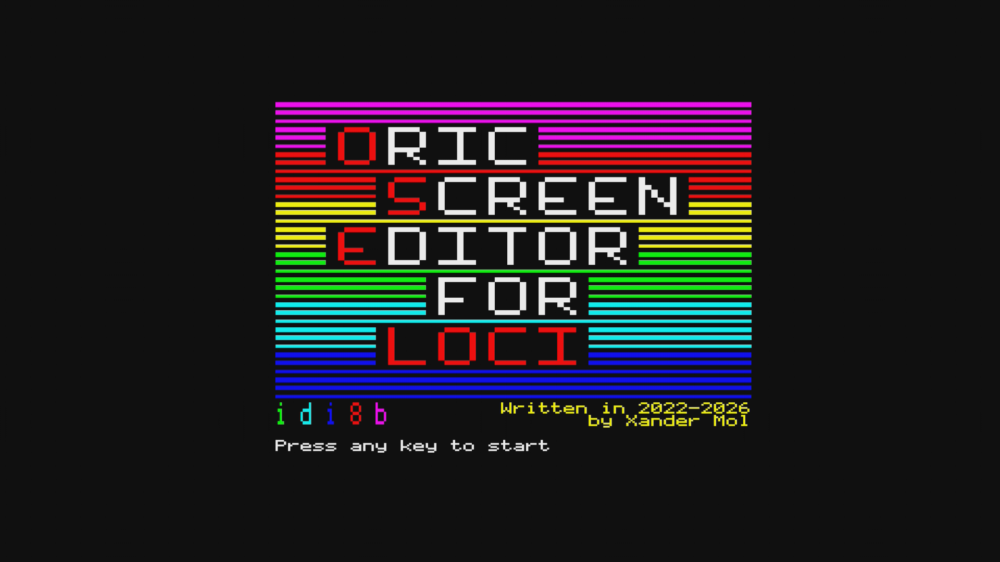

## Version history and download
([Back to contents](#contents))

Link to the latest release:
https://github.com/xahmol/OricScreenEditorLOCI/releases/latest

Version v1.0.0 (initial public release):

- From-scratch rewrite in Oscar64 C targeting the Oric Atmos 6502A bare-metal
- **LOCI mass-storage device required** — canvas lives in overlay RAM; all file I/O is LOCI-based
- Full localisation: English (`oseloci.tap`) and French (`oseloci_fr.tap`) builds, each with their own title screen and help screens
- Canvas-edit undo/redo (up to 40 levels, backed by overlay RAM)
- LOCI XRAM-backed file picker with full filesystem traversal across drives and subdirectories
- Save/Load Screen, Project (4-file scheme), Combined (both charsets + screen), and Charset (Std / Alt / Combined) formats; full V1 project file compatibility
- Character editor: direct live charset RAM edits, per-row hex input, inline undo
- Charset-swap mechanism protecting popup chrome from user-redefined glyphs
- Colour picker for visual ink/paper selection
- IJK joystick support (Raxiss interface), detected automatically
- Try mode, Goto/Home, Find/Replace, hollow box + ellipse in Line/Box mode
- Charset > Reset Std→ROM and Reset Alt→Boot
- Hex-direct attribute entry in Write mode (FUNCT+4)
- Phosphoric headless automated test suite: 200/200 tests passing

## Introduction
([Back to contents](#contents))

Oric Screen Editor for LOCI (OSE-LOCI) is a character-set-aware screen editor for the Oric Atmos, rewritten from scratch in Oscar64 C. It is based on [OricScreenEditor V1](https://github.com/xahmol/OricScreenEditor) (the original CC65 version) and extends it with LOCI mass-storage support, canvas-edit undo/redo, and several new editing features.

**A LOCI mass-storage device is required to run the program at all.** The canvas itself lives in LOCI-backed overlay RAM ($C000–$E7FF) rather than in the Oric's main RAM. If no LOCI device is detected at startup, the program shows a message and exits rather than entering the editor.

Main features:

- Support for canvas sizes larger than 40×28 characters. Canvases can be any size from 1×1 upward, up to 10 KiB (10,240 bytes) total. Width and height are not limited to the 40×28 viewport — the editor auto-scrolls the viewport when the cursor reaches an edge.
- Resize, clear or fill the canvas at any time via the Screen menu
- Full LOCI file I/O with an XRAM-backed file picker supporting full filesystem traversal. Save/Load Screen, Project, Combined, and Charset formats. Saves both Standard and Alternate charset banks when edited.
- Includes a character editor (sidebar popup) to modify glyphs live — edits apply directly to charset RAM and update all canvas cells using that glyph in real time
- Supports Oric serial attributes: ink color, paper color, and character modifiers (standard vs alternate charset, double height, blink)
- Canvas-edit undo/redo (**Z**/**Y**) backed by overlay RAM, up to 40 levels
- Write mode for freely typing text with the full keyboard
- Line and box mode: filled box, hollow box, filled ellipse, or hollow ellipse inscribed in the bounding box
- Select mode: grow a rectangle, then cut, copy, delete, or fill with ink/paper/modifier attribute
- Move mode: scroll the viewport's content in any direction
- Palette mode with a visual charmap option for the alternate charset
- Colour picker for selecting ink and paper colors together from a visual grid
- Favorite slots to quickly access 10 frequently-used characters
- **IJK joystick support** (Raxiss IJK interface) — detected automatically at startup, works alongside the keyboard everywhere cursor keys and ENTER are used
- **Try mode** (**T**): preview a character without committing it; SPACE confirms, any other key cancels
- **Goto** (**J**): open a popup to jump the cursor and viewport to any typed canvas coordinate
- **Home** (**H**): jump straight to the canvas origin (0,0) without a popup
- **Find/Replace** (**F**): locate or replace screencodes and ink/paper colors across the whole canvas
- **Hollow box and ellipse** toggles in Line/Box mode (**O**, **C**)
- **Charset > Reset Std→ROM**: restore the standard charset from ROM in one step
- **Charset > Reset Alt→Boot**: restore the alternate (mosaic) charset from the boot-time snapshot
- **Hex-direct attribute entry** in Write mode (**FUNCT+4**)
- Available in English and French (both title screen and help screens localised)

## Start program
([Back to contents](#contents))

**Requirements:** an Oric Atmos with a LOCI mass-storage device attached. The editor will not start without one — when no LOCI is detected, it shows a message and exits.

**Installation:**

1. Download the latest release ZIP from the [Releases page](https://github.com/xahmol/OricScreenEditorLOCI/releases/latest).

2. Unzip the entire contents into a single folder on the LOCI device's SD card. You can choose any folder name. The program loads its asset files (title screen, help screens) relative to the directory it was launched from, so all files must be in the same folder.

3. Use the LOCI interface to navigate to the folder and launch the `.tap` file for your preferred language:
   - `oseloci.tap` — English build
   - `oseloci_fr.tap` — French build

   For instructions on navigating directories and launching `.tap` files with the LOCI hardware, see the [LOCI User Manual](https://github.com/sodiumlb/loci-hardware/wiki/LOCI-User-Manual).

**Files included in the release ZIP:**

| Filename | Description |
|---|---|
| `oseloci.tap` | Main program — English |
| `oseloci_fr.tap` | Main program — French |
| `OSETSC.BIN` | Title screen (EN) |
| `OSETSF.BIN` | Title screen (FR) |
| `OSEHS1.BIN`–`OSEHS4.BIN` | Help screens EN: main mode / character editor / select+move+line-box / write |
| `OSEHF1.BIN`–`OSEHF4.BIN` | Help screens FR |
| `PETSCIIPJ/SC/CS/CA.BIN` | Demo project: PETSCII art (from OricScreenEditor V1) |
| `OSEDEMOPJ/SC/CS/CA.BIN` | Demo project: colour swatch + pixel-art sun |
| `OSEDEMO.BIN` | Same demo in Combined format (File > Load Combined) |
| `OSELOGOPJ/SC/CS/CA.BIN` | Demo project: Oric company logo in hand-drawn glyphs |
| `LUDOTITLPJ/SC/CS/CA.BIN` | Demo project: Ludo title screen |
| `LUDOSCRMPJ/SC/CS/CA.BIN` | Demo project: Ludo game screen |
| `README.pdf` | This manual (EN) |
| `README_fr.pdf` | This manual (FR) |

All demo projects are loadable via **File > Load Project**. `OSEDEMO.BIN` is also loadable via **File > Load Combined**.

Leave the title screen by pressing any key. The editor starts in Main mode.

## Build from source
([Back to contents](#contents))

**Prerequisites:**

- [Oscar64](https://github.com/drmortalwombat/oscar64) compiler. Set `OSCAR64_HOME` to the Oscar64 install directory (default: `~/oscar64`).
- Python 3 (for the `mktap.py` tape-wrapping tool).
- GNU Make.
- Optional: `pandoc` + `texlive-xetex` for regenerating the PDF manuals (`make docs`).
- Optional: [Phosphoric](https://github.com/benedictemarty/Phosphoric) emulator for the automated test suite (`make test`).

**Building:**

```
git clone https://github.com/xahmol/OricScreenEditorLOCI.git
cd OricScreenEditorLOCI
make              # EN build → build/oseloci.tap
make LANG=FR      # FR build → build/oseloci_fr.tap
make all-langs    # build both language variants
make docs         # regenerate README.pdf / README_fr.pdf
make zip          # build release ZIP (both taps + all assets + READMEs)
```

**Copying to a LOCI device:**

1. Copy `.env.example` to `.env` and set `USBPATH` to the target directory on the LOCI SD card (e.g. `/mnt/e/idi8b/OSEforLOCI` on WSL2, or `/media/yourname/SDCARD/ose` on Linux).
2. Run `make usb` — builds both language variants, then copies all `.tap` and asset `.BIN` files to `USBPATH`. On WSL2, auto-mounts and unmounts the Windows drive.

**Compiler flags (for reference):**

```
oscar64 -n -tf=bin -rt=include/oric_crt.c -i=include -i=src -O2 -dNOFLOAT
```

`-n` = native 6502 mode; `-tf=bin` = raw binary output; `-O2` = whole-program optimiser.

## Main mode
([Back to contents](#contents))

After the title screen, the program starts in this mode. An inverted cursor showing the presently selected screencode is visible at the canvas origin.

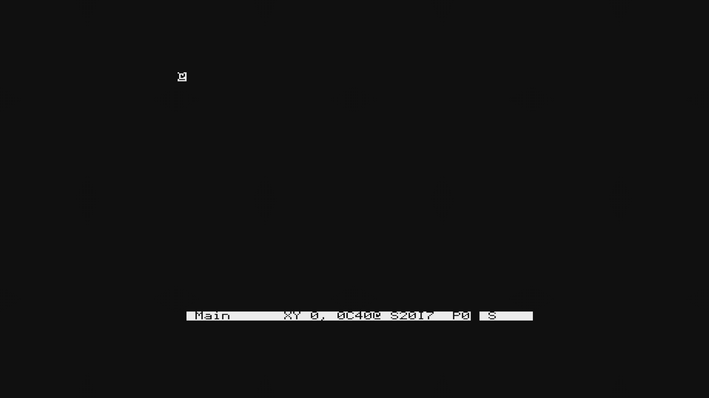

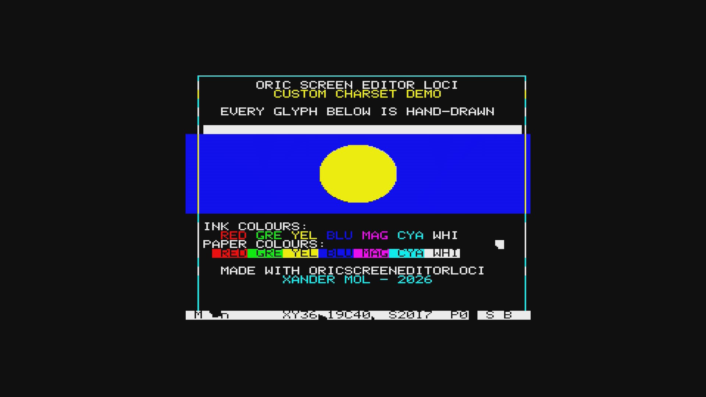

Press these keys in main mode for editing:

|Key|Description
|---|---|
|**Cursor keys**|Move cursor (auto-scrolls the viewport if the canvas is larger than 40×28)
|**+** or **=**|Next character (increase screen code)
|**-**|Previous character (decrease screen code)
|**0-9**|Select character from favorite slot with corresponding number
|**SHIFT + 0-9**|Store character to favorite slot with corresponding number
|**,**|Previous ink (decrease color number)
|**.**|Next ink (increase color number)
|**;**|Decrease paper (decrease color number)
|**\'**|Increase paper (increase color number)
|**SPACE**|Plot with present screen code and attributes
|**DEL**|Clear present cursor position (plot white space)
|**B**|Toggle '**B**link' attribute
|**A**|Toggle **A**lternate or Standard character set
|**D**|Toggle **D**ouble height attribute
|**I**|Plot a change **I**nk modifier attribute for the present selected ink color
|**O**|Plot a change Paper m**o**difier attribute for the present selected paper color
|**U**|Plot a character-set modifier attrib**u**te for the present selected charset, double size and blink attributes
|**E**|Go to 'character **E**dit mode' with present screen code
|**G**|**G**rab: read the character or attribute under the cursor into the plot settings
|**W**|Go to '**W**rite mode'
|**L**|Go to '**L**ine and box mode'
|**M**|Go to '**M**ove mode'
|**S**|Go to '**S**elect mode'
|**P**|Go to '**P**alette mode'
|**C**|Go to '**C**olour picker'
|**T**|**T**ry mode — preview current character without committing
|**R**|Toggle '**R**everse video': XOR screencode with 128
|**J**|**J**ump (Goto) — jump cursor and viewport to a typed canvas X/Y coordinate
|**H**|**H**ome — jump cursor and viewport to canvas origin (0,0)
|**F**|**F**ind/Replace a screencode or ink/paper color across the whole canvas
|**Z**|Undo the most recent canvas edit
|**Y**|Redo the most recently undone edit
|**FUNCT+1**|Go to main menu
|**FUNCT+6**|Toggle statusbar visibility
|**FUNCT+8**|Help screen

**NB:** In Oricutron with the default keyboard mapping, the FUNCT key is mapped to the PC ALT key.

*Moving the cursor*

Press the **cursor keys** to move the cursor around the screen. If the canvas is larger than the 40×28 viewport, the screen auto-scrolls when the cursor reaches an edge.

*Selecting the screencode to plot*

The **+** or **=** key increases the selected screencode by one; **-** decreases it. The cursor preview updates to show the currently selected screencode.

Pressing **R** XORs the screencode with 128, toggling the reverse-video bit (hardware pixel inversion).

*Selecting screencodes from a favorite slot*

Ten favorite slots are available. Pressing **0-9** selects the corresponding favorite; **SHIFT+0-9** stores the currently selected character into that slot.

*Selecting the attributes to plot*

Increase or decrease the [color code](#color-value-reference) by pressing **.** / **,** for ink, or **;** / **\'** for paper. Press **B**, **D** or **A** to toggle **B**link, **D**ouble size or **A**lternate charset. Alternatively, press **C** to open the [colour picker](#colour-picker) and choose ink and paper together from a visual grid.

*Plotting and deleting a character*

Press **SPACE** to plot the presently selected character at the cursor position. **DEL** replaces the cell with a space.

Press **T** to preview how the selected character would look when plotted. Press **SPACE** to confirm and commit it, or any other key to cancel.

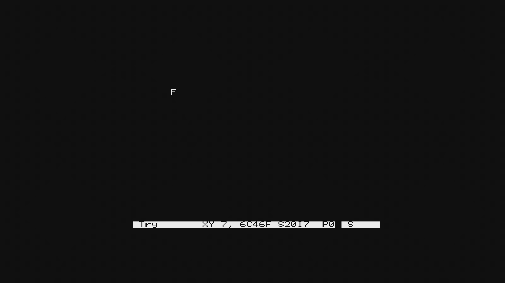

*Plotting serial attributes*

Due to the way the Oric handles [color and attribute changes](#serial-attribute-code-reference), every screen position is either an attribute modifier or a character — never both. For this reason, plotting a character does not automatically plot any attribute.

Press **I** to plot an **I**nk modifier for the current ink color, **O** to plot a Paper modifier for the current paper color, and **U** to plot a character-set modifier reflecting the current alternate, double and blink settings.

*Grabbing a character*

Pressing **G** reads the character or attribute at the cursor position into the plot settings: a code >31 sets `plotscreencode`; a code <8 sets ink; a code >15 sets paper; codes 8–15 decode the charset, double and blink toggles. The cursor preview updates accordingly.

*Character edit mode*

Press **E** to enter [character edit mode](#character-editor) for the currently selected screencode. Tip: move the cursor over a character you want to edit, press **G** to grab it, then **E** to edit it.

*Enter edit modes*

Press **S** ([Select mode](#select-mode)), **M** ([Move mode](#move-mode)), **L** ([Line and box mode](#line-and-box-mode)) or **W** ([Write mode](#write-mode)) to enter the corresponding mode. Press **ESC** in any mode to return to main mode.

*Jump to coordinates and Home*

Press **J** to open a popup asking for an X then a Y canvas coordinate (both pre-filled with the cursor's current position). Confirming both jumps the cursor and viewport there in one step — much quicker than scrolling cell by cell on a canvas larger than the 40×28 screen. ESC at either field cancels with no change.

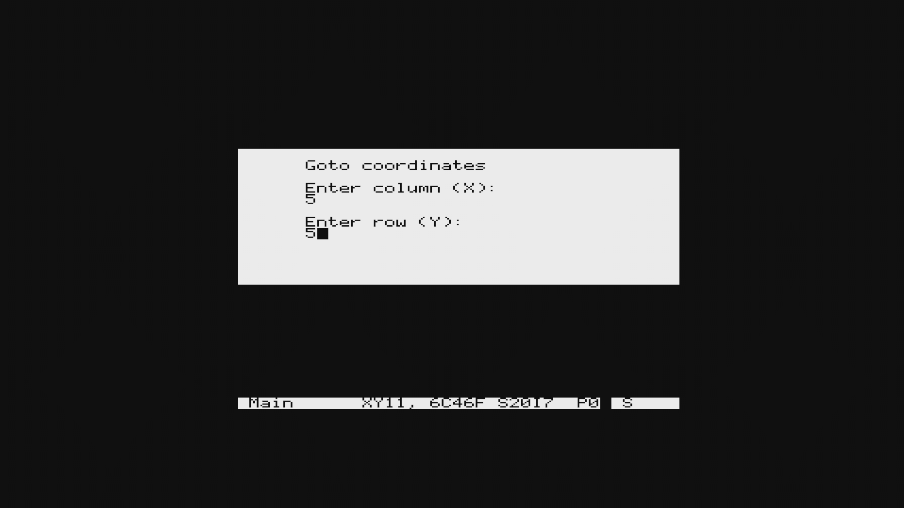

Press **H** to jump straight back to the canvas origin (0,0) without any popup.

*Find/Replace*

Press **F** to open the Find/Replace popup. First choose what to search for: **1** for screencode, **2** for ink color, or **3** for paper color. Next, enter the value to find (a hexadecimal screencode, or a color number 0–7). Finally, either:
- Press **ENTER** with a replacement value to replace every matching occurrence across the whole canvas (undoable with **Z** afterwards).
- Press **ESC** at the replacement step to instead jump the cursor to the next occurrence of the found value without changing the canvas.

ESC at the first two steps cancels the whole operation.

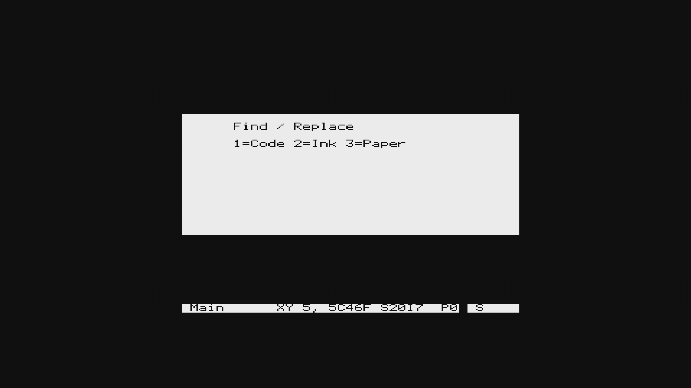

*Undo and redo*

Press **Z** to undo the most recent canvas edit (plotting, Line/Box, Select fills/cut/copy, Move, Write mode, or Screen > Clear/Fill), and **Y** to redo the most recently undone edit. Undo history is stored in overlay RAM ($E800–$FFFF, 6 KiB), holding up to 40 levels. Screen > Clear/Fill on a canvas larger than 6 KiB is explicitly non-undoable.

*Toggle statusbar visibility*

Press **FUNCT+6** to toggle the statusbar on/off in any mode.

*Help screen*

Press **FUNCT+8** to show a help screen with all keyboard commands for the current mode.

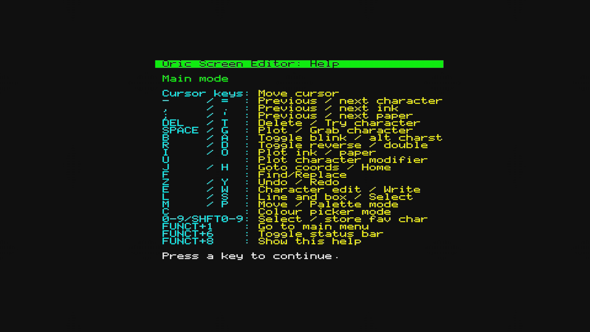

## Statusbar
([Back to contents](#contents))

If enabled, the statusbar occupies the last row of the screen (row 27). It auto-hides when the cursor moves to that row (showing the real canvas content there instead), and reappears when the cursor moves away.


From left to right:

- **Mode**: current mode (Main, Select, Line/Box, Palette, Character Editor, etc.)
- **X,Y**: absolute canvas coordinates of the cursor (row and column counting from the canvas origin, not the viewport). Displayed in decimal; switches to hexadecimal if either canvas dimension exceeds 99.
- **C**: selected screencode — numeric (hex) then visual character
- **S**: byte in canvas memory at the cursor position — either a character code (>$20) or an attribute code (<$20), in hex
- **I**: selected ink color — number 0–7, then a color swatch
- **P**: selected paper color — number 0–7, then a color swatch
- **A / S**: alternate charset toggle (A=Alt, S=Std)
- **D / _**: double height toggle
- **B / _**: blink toggle

Pressing **FUNCT+6** toggles statusbar visibility in every mode.

## Main menu
([Back to contents](#contents))

From main mode, press **FUNCT+1** to open the menu bar. Navigate with:

|Key|Description
|---|---|
|**Cursor LEFT / RIGHT**|Move between menu bar entries
|**Cursor UP / DOWN**|Move between pulldown options
|**RETURN**|Select highlighted option
|**ESC**|Leave menu and go back

(Note: if the canvas uses a modified character set, the program temporarily restores the ROM font while the menu is open so the popup chrome renders correctly. Your canvas is restored when the menu closes — this is the charset-swap mechanism.)

**_Screen menu_**

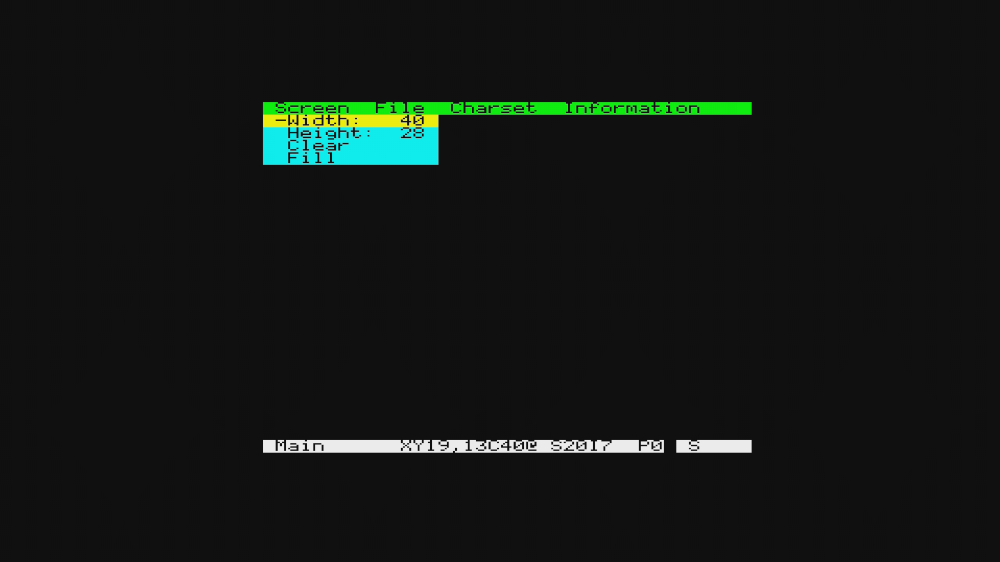

*Width: Resize width*

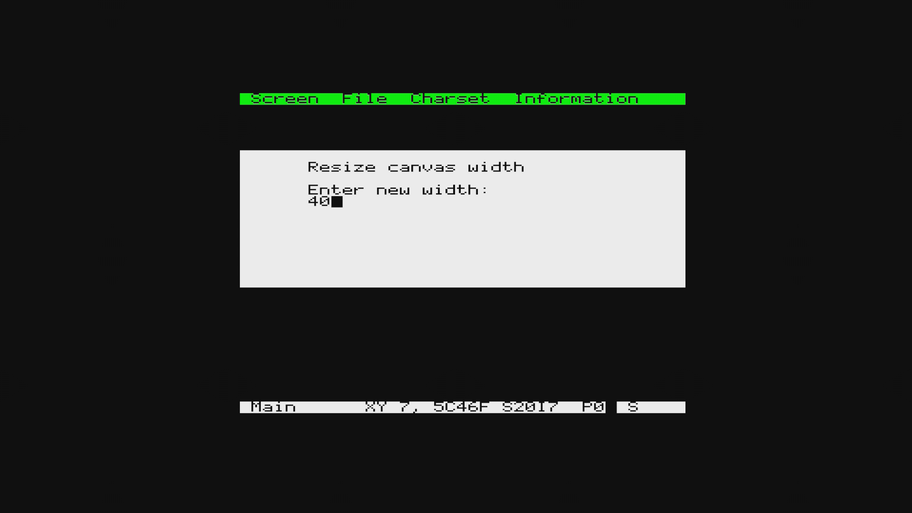

Resize the canvas width by entering the new width. Any width from 1 upward is accepted, provided width×height does not exceed 10,240 bytes. Shrinking below the current width discards any columns to the right of the new boundary; a confirmation dialog appears before shrinking.

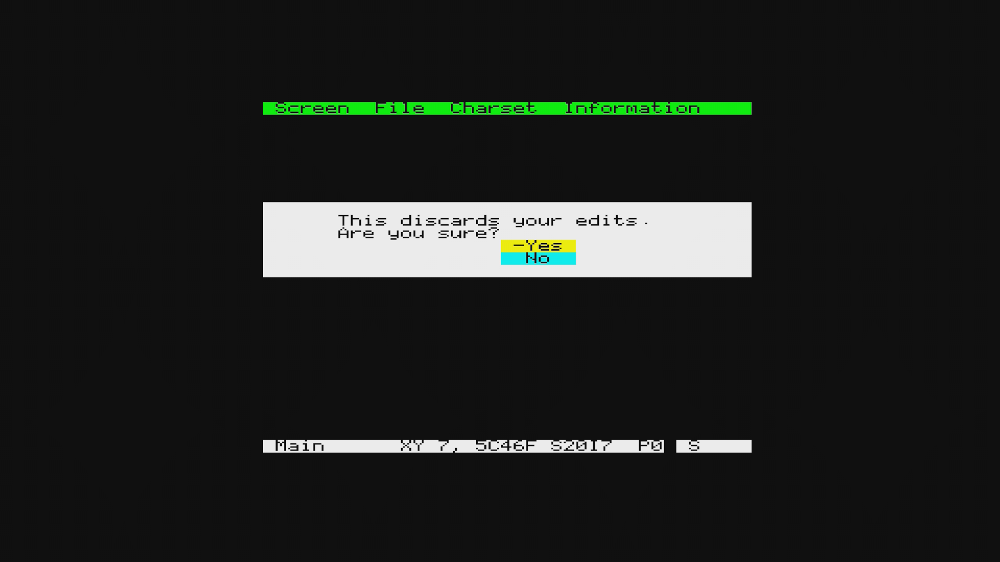

*Height: Resize height*

As above for height. Any height from 1 upward, same ceiling constraint. After resize, `canvas_goto(0,0)` re-centers the viewport.

*Clear: Clear the canvas*

Fills the entire canvas with spaces and resets ink/paper attributes in the first two columns of each row to the currently selected values. This operation is undoable with **Z** only if the canvas is 6 KiB or smaller; on larger canvases it is not undoable.

*Fill: Fill the canvas*

Like Clear, but fills with the currently selected screencode rather than a space. Same undo limit applies.

**_File menu_**

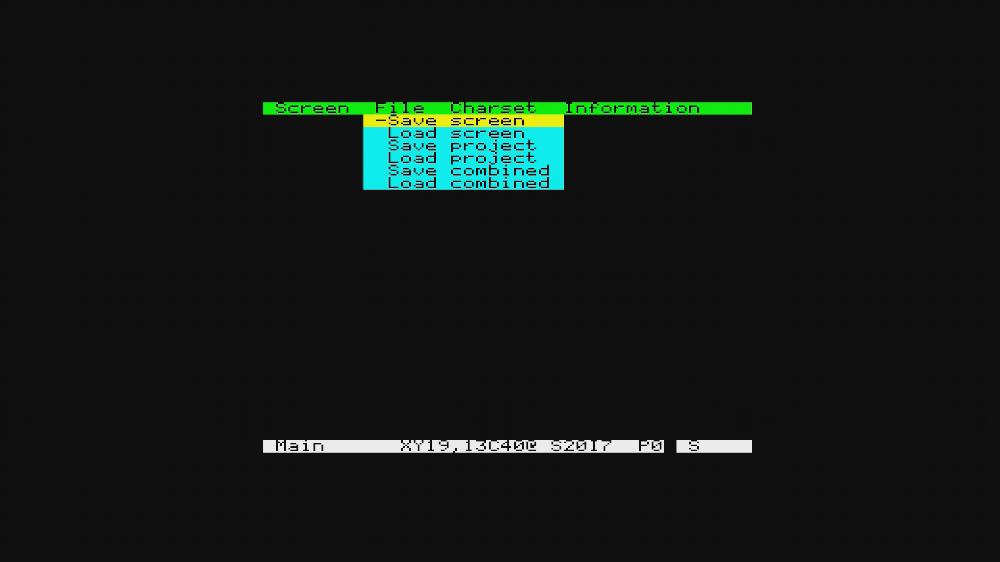

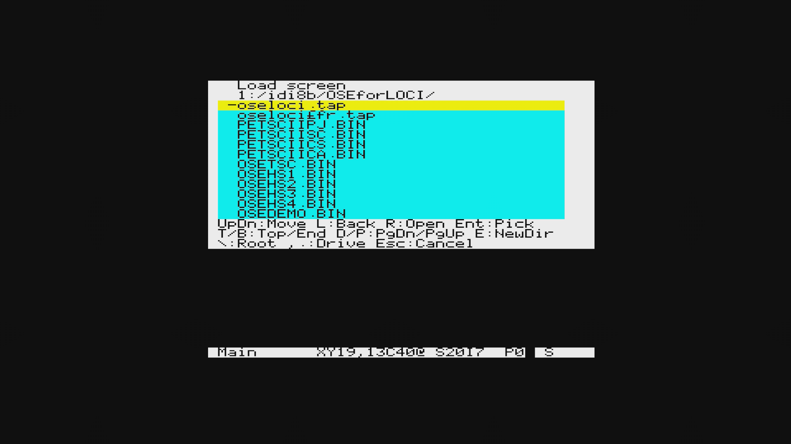

All File menu actions use the **LOCI mass-storage device** — no tape commands. Both Save and Load actions open the same XRAM-backed file picker directory browser first.

**Save actions** present a `<new file>` entry at the top of the listing plus the existing files. Press ENTER on `<new file>` to type a fresh filename (up to 48 characters); press ENTER on an existing file to overwrite it (with a confirmation prompt).

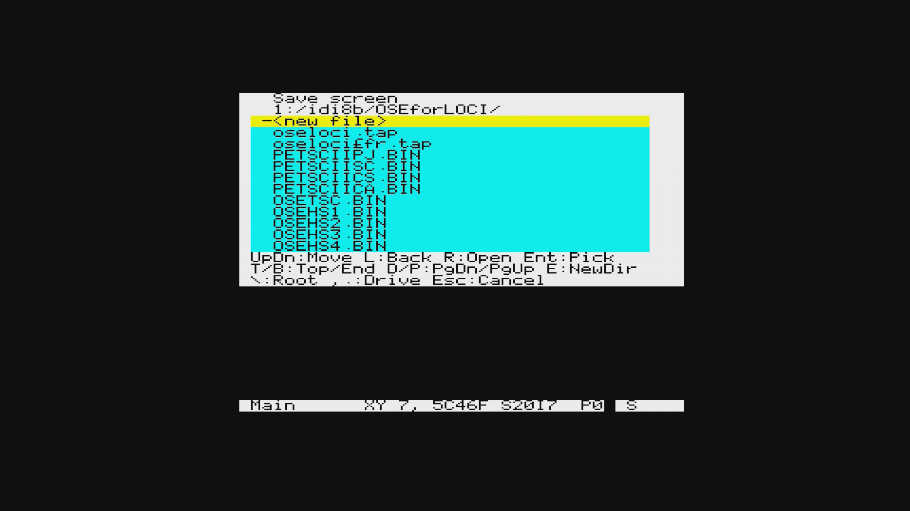

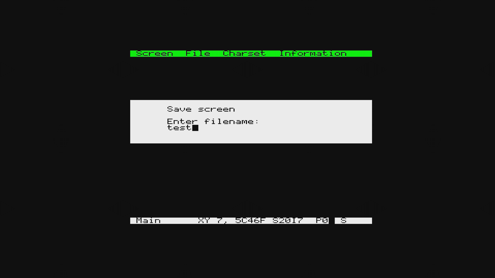

**Load actions** let you browse and select the file directly from the listing. Load Project shows only project files (`*PJ.BIN`); all other Load actions (Screen, Combined, Charset) show every file in the directory with no filtering.

The file picker supports full filesystem traversal:

|Key|Description
|---|---|
|**Cursor UP/DOWN**|Move the highlighted entry
|**Cursor LEFT**|Go up to the parent directory
|**Cursor RIGHT / RETURN**|Enter a highlighted directory
|**RETURN**|Select a highlighted file (Load actions) or confirm overwrite (Save actions)
|**T**|Jump to the top of the listing
|**B**|Jump to the bottom of the listing
|**D**|Page down
|**P**|Page up
|**\\**|Jump to the root of the current drive
|**. / ,**|Switch to the next/previous drive (0–9, skipping absent drives)
|**E**|Create a new subdirectory here
|**FUNCT+6**|Toggle the statusbar
|**ESC**|Cancel and go back

Copying, renaming and deleting files/directories are not supported — use a LOCI-aware tool on the host PC for those operations.

*Save screen / Load screen*

Saves or loads just the canvas (no character sets) as `<filename>.BIN` on the LOCI device: a bare dump of the screen data with no header or metadata — matching V1 exactly for portability. Because there is no header, Load screen asks you to enter the canvas width and height (pre-filled with the current canvas size) before loading.

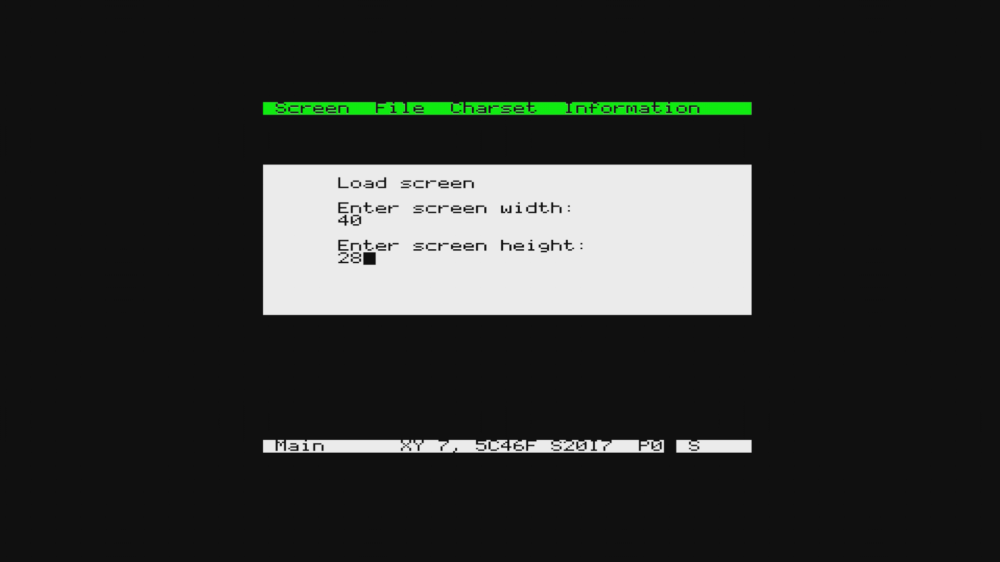

*Save project / Load project*

Saves or loads the canvas together with all metadata: cursor position, viewport offsets, ink/paper/blink/double/altchar selection, and — if edited this session — either or both character sets. Up to four files share the base name:

- `<filename>PJ.BIN` — project header (canvas size, cursor/offset, plot attributes, magic sentinel)
- `<filename>SC.BIN` — canvas screencodes (bare, no header)
- `<filename>CS.BIN` — standard charset (only written/expected if you edited it this session)
- `<filename>CA.BIN` — alternate charset (same condition)

Load project auto-detects the canvas size from `PJ.BIN` — no width/height prompt. It also **transparently accepts V1 (CC65 version) project files** — the 19-byte V1 header format is auto-detected via the magic sentinel field.

*Save combined / Load combined*

Saves or loads both character sets and the canvas in a single `<filename>.BIN` file in memory-map order. Because the format mirrors a fixed region of Oric RAM, the canvas must be exactly 40×28 or 40×27 — other sizes are rejected. Load combined auto-detects the height from the file size, so no width/height prompt is needed. See the [File format reference](#file-format-reference) for the exact byte layout.

**_Charset menu_**

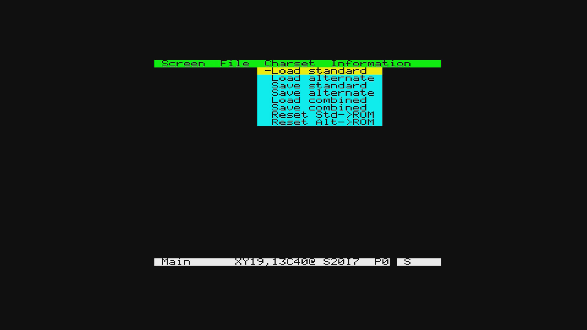

Load or save the standard or alternate character set separately (`<filename>.BIN`: 768 bytes for the standard set, 640 bytes for the alternate set — the alternate charset only has 640 bytes of usable glyph space on real Oric hardware, since the rest of the bank physically overlaps the screen RAM), or "combined": 768 bytes standard + 256 bytes alternate non-displayable prefix + 640 bytes alternate displayable = 1,664 bytes total, both banks saved and loaded together. See the [File format reference](#file-format-reference) for the exact layout.

*Reset Std→ROM*

Restores the standard character set from the Oric's ROM font in one step, discarding any edits made to it this session. Asks for confirmation first. Only the standard set can be reset this way — use Reset Alt→Boot for the alternate set.

*Reset Alt→Boot*

Restores the alternate (mosaic) character set from the snapshot taken when the program first started, discarding any edits made to it this session. Asks for confirmation first. This uses the boot-time snapshot rather than the ROM, because the Oric generates the alternate/mosaic font algorithmically at startup — it is not stored as a static table in ROM.

**_Information menu_**

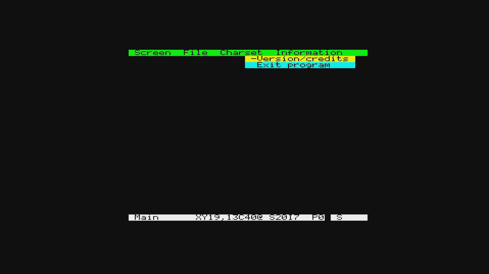

*Information*

Shows a 2-page popup: a page with the IDreamtIn8Bits logo, version number, and credits; followed by a page with a QR code linking to this project's GitHub page. Press any key to advance between pages and to return to the menu afterwards.

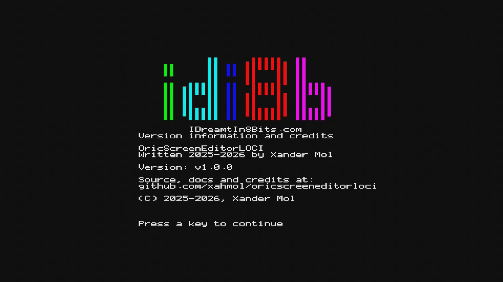

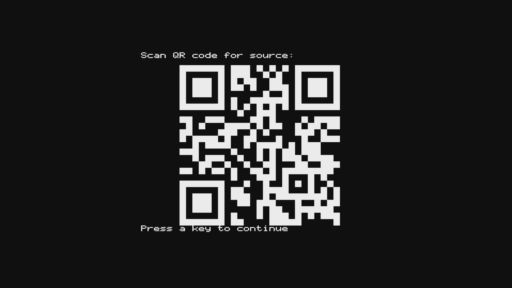

*Exit program*

Resets the Oric back to its cold-start state (jumps through the RESET vector). No confirmation is asked and unsaved work will be lost.

## Character editor
([Back to contents](#contents))

Pressing **E** from main mode opens the character editor as a narrow sidebar popup (columns 26–39, rows 0–14). The rest of the canvas remains visible and continues to show the effect of any glyph edits live — character edits apply directly to charset RAM, so every occurrence of the edited character on the canvas updates in real time.

The popup header shows the current screencode (hex) and whether the Standard (Std) or Alternate (Alt) charset is active. Rows below the header show the 8×6 pixel grid, with the row's hex byte value shown immediately to the left of each grid row.

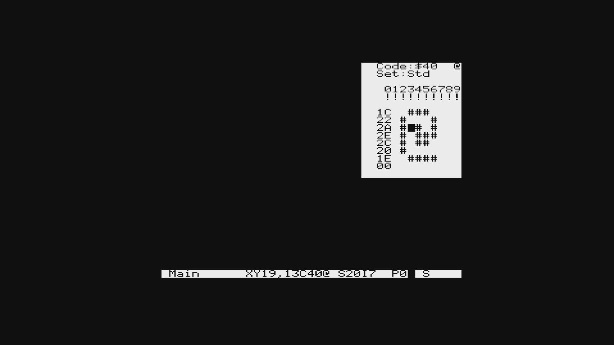

Keyboard commands in this mode:

|Key|Description
|---|---|
|**Cursor keys**|Move cursor within the 8×6 pixel grid
|**+**|Next character (increase screen code)
|**-**|Previous character (decrease screen code)
|**=**|Same as **+**
|**A**|Toggle between Standard and **A**lternate charset
|**0-9**|Select character from favorite slot
|**SHIFT + 0-9**|Store character to favorite slot
|**SPACE**|Toggle pixel at cursor position
|**DEL**|Clear all pixels in the current character
|**I**|**I**nvert all pixels (XOR with $3F)
|**Z**|Undo the last edit to the current character (single-level, not the canvas undo)
|**S**|Re**s**tore current character from the ROM system charset (Standard charset only)
|**C**|**C**opy current character to buffer
|**V**|Paste buffer into current character
|**X**|Mirror horizontally (flip bits left/right)
|**Y**|Mirror vertically (flip rows up/down)
|**L** / **R** / **U** / **D**|Scroll glyph pixels Left / Right / Up / Down (wrapping)
|**H**|Input the **H**ex value for the row at the cursor position
|**ESC**|Leave character editor and return to main mode
|**FUNCT+6**|Toggle statusbar visibility
|**FUNCT+8**|Help screen

*Moving the cursor*

Press the **cursor keys** to move the cursor around the pixel grid. The current pixel state toggles with **SPACE**.

*Selecting which character to edit*

**+** or **=** increases the screencode; **-** decreases it. **A** toggles between Standard (codes $20–$7F) and Alternate (codes $20–$6F; codes $70–$7F would overlap screen RAM and are excluded).

*Toggling pixels*

**SPACE** toggles the pixel at the cursor. **DEL** clears all pixels. **I** inverts all pixels. **Z** reverts the current character to its state before this edit session (single-level undo — switching to a different screencode does not preserve the previous one's undo history).

*Copy, paste, mirror, scroll*

**C** copies the current glyph to a buffer; **V** pastes it at the current screencode. **X** / **Y** mirror the glyph horizontally/vertically. **L**, **R**, **U**, **D** scroll the pixel grid one step in the named direction with wrapping.

*Hex input*

Press **H** to edit the current row by typing its 8-bit value as two hex digits directly on screen at the row's position.

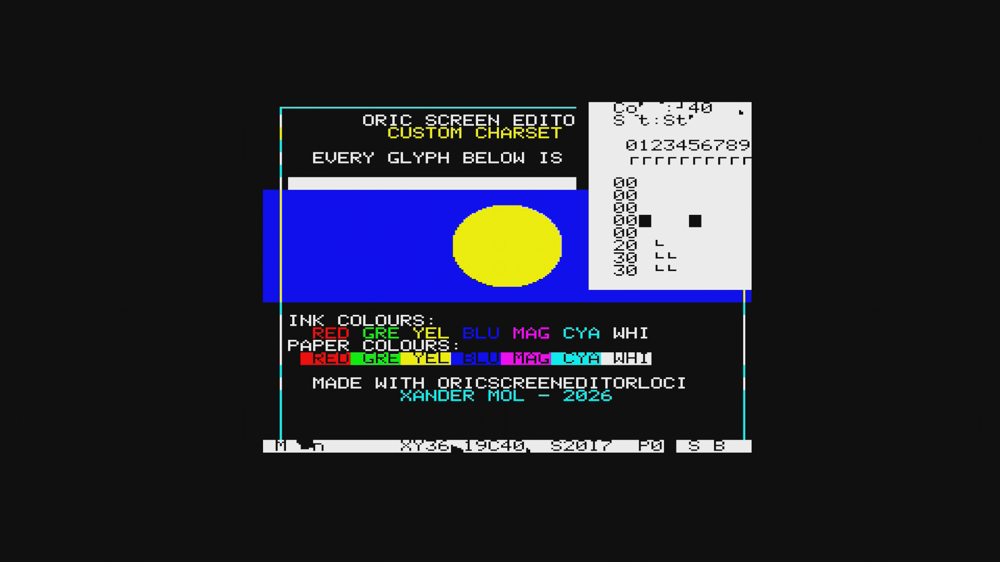

*Restore from ROM*

Press **S** (Standard charset only) to copy the ROM glyph for the current screencode into the live charset RAM, overwriting any edits. The ROM glyph covers codes $20–$7F (printable ASCII range). There is no ROM source for the Alternate charset — use **Charset > Reset Alt→Boot** from the main menu to restore the whole Alt bank from the boot-time snapshot.

## Palette mode
([Back to contents](#contents))

Pressing **P** in main mode opens the Palette mode. A popup shows the 10 favorite slots as the first row, followed by the full Standard charset (codes $20–$7F, 6 rows of 16), then the full Alternate charset (or a visual-charmap reordering of it, see below).

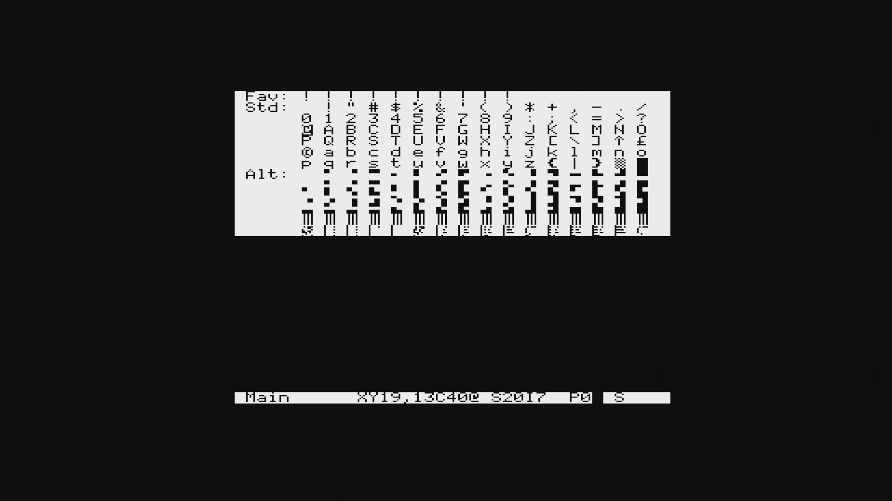

Keyboard commands:

|Key|Description
|---|---|
|**Cursor keys**|Move cursor (wraps between sections)
|**SPACE or ENTER**|Select highlighted character and return to main mode
|**0-9**|Store highlighted character to the corresponding favorite slot
|**V**|Toggle between normal mode and **v**isual charmap mode
|**ESC**|Return to main mode without changing the selected character
|**FUNCT+6**|Toggle statusbar visibility

*Visual charmap mode*

Pressing **V** toggles visual charmap mode, which reorders the Alternate charset section so that characters are arranged in a logical drawing order (designed around the Oric's native mosaic/semigraphics font). This mode only makes sense for an unmodified Alternate charset. Visual charmap mode covers codes $20–$6F; codes $70–$7F always remain in their natural order.

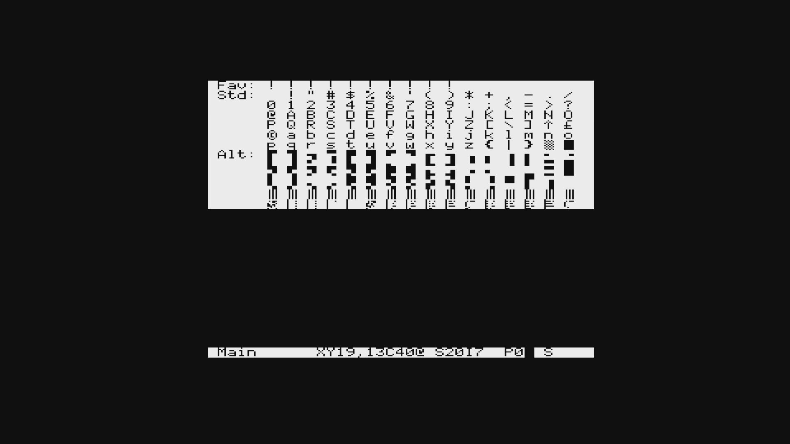

## Colour picker
([Back to contents](#contents))

Pressing **C** in main mode opens the Colour picker, which provides a visual grid for selecting the Ink and Paper colors to plot with.

The popup shows all 64 Ink/Paper combinations as an 8×8 grid (one row per Paper value, one column per Ink value). Each cell shows a normal and an inverse color swatch side by side. Three rows below the grid show feedback for the currently highlighted Ink, Paper, and the resulting normal/inverse preview.

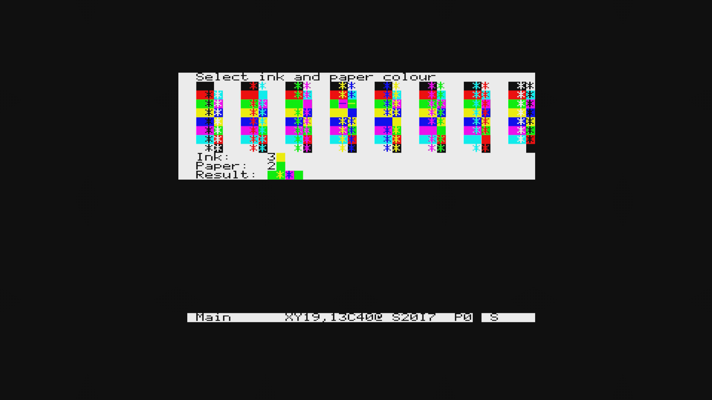

Keyboard commands:

|Key|Description
|---|---|
|**Cursor LEFT / RIGHT**|Cycle Ink color (wraps 0–7)
|**Cursor UP / DOWN**|Cycle Paper color (wraps 0–7)
|**SPACE or ENTER**|Accept highlighted Ink/Paper combination and return to main mode
|**ESC**|Return to main mode without changing the selected Ink/Paper colors
|**FUNCT+6**|Toggle statusbar visibility

## Select mode
([Back to contents](#contents))

Pressing **S** in main mode enters Select mode. Position the cursor at one corner of the area to select before entering.

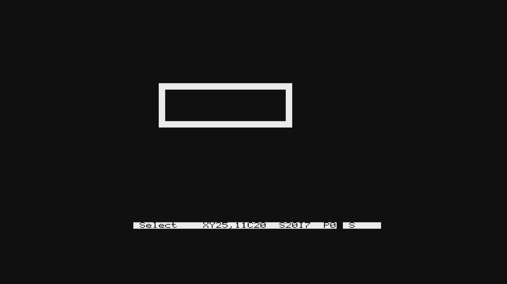

**Phase 1 — grow the selection:** cursor keys expand or contract the rectangle from the starting corner. The selection is highlighted using the current screencode and attributes. Press **RETURN** to accept; **ESC** cancels and returns to main mode. **FUNCT+8** shows the help screen (only before the selection has started growing).

**Phase 2 — choose action:** after accepting, the statusbar mode field shows the available actions.


Press one of:

|Key|Description
|---|---|
|**X**|Cut: copy selection to a new position, clearing the original
|**C**|**C**opy: copy selection to a new position, leaving the original intact
|**D**|**D**elete: fill selection with spaces
|**I**|Paint with **I**nk attribute: fill with ink modifier for the current ink color
|**P**|Paint with **P**aper attribute: fill with paper modifier for the current paper color
|**M**|Paint with character **M**odifier attribute
|**ESC**|Cancel and return to main mode

**Cut and copy:** after pressing **X** or **C**, move the cursor to the upper-left corner of the destination, then press **RETURN** to confirm or **ESC** to cancel.

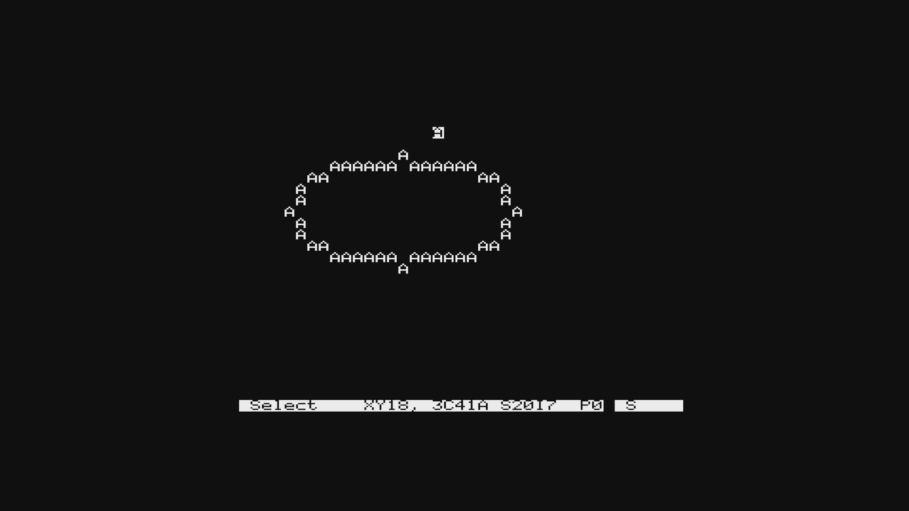

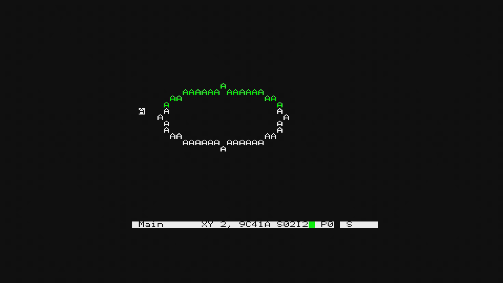 If the selection would extend past the canvas edge, a "Selection does not fit." message appears and nothing changes. Cut uses two undo slots (one for the destination, one for the source) — reverting a cut requires two **Z** presses.

**Delete and paint:** fill the selection immediately with no further input needed. These use one undo slot.

Other keys while in Select mode:

|Key|Description
|---|---|
|**Cursor keys**|Expand/shrink selection (phase 1) or move cursor to destination (cut/copy phase)
|**RETURN**|Accept selection / confirm destination
|**ESC**|Cancel and go back to main mode
|**FUNCT+6**|Toggle statusbar visibility
|**FUNCT+8**|Help screen

## Move mode
([Back to contents](#contents))

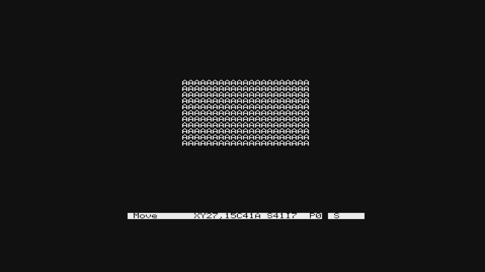

Pressing **M** in main mode enters Move mode. Use this mode to scroll the current viewport's content in any direction using the cursor keys. Each keypress shifts all cells in the 40×28 viewport area one step in that direction within `screenmap[]`; content that scrolls off the edge is lost.

**Note:** each shift is applied immediately — RETURN and ESC both leave Move mode and both keep whatever shifts you have already made. There is no scratch buffer to roll back from. Use **Z** (undo) after exiting if you want to revert.

Move mode operates on the viewport area only. On a canvas larger than 40×28, only the visible 40×28 window is shifted; canvas cells outside the viewport are not affected.

|Key|Description
|---|---|
|**Cursor keys**|Shift viewport content in the selected direction
|**RETURN or ESC**|Leave Move mode and return to main mode
|**FUNCT+6**|Toggle statusbar visibility
|**FUNCT+8**|Help screen

## Line and box mode
([Back to contents](#contents))

Pressing **L** in main mode enters Line and box mode. Position the cursor at one corner of the box or at the start of the line before entering.

**Phase 1 — grow the bounding box:**

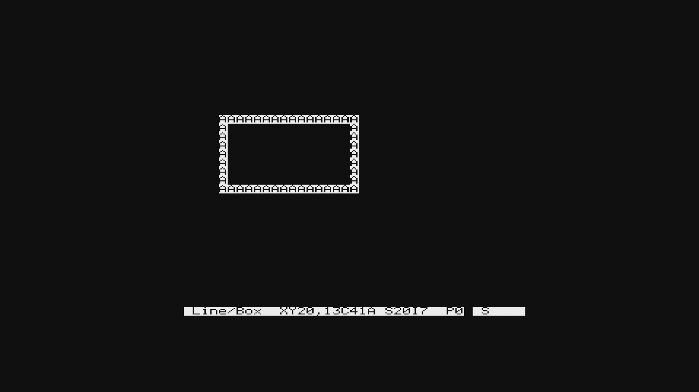 cursor keys expand or contract the rectangle. Leaving width or height at 1 draws a line; otherwise a box or ellipse is drawn. Press **RETURN** to accept; **ESC** cancels and returns to main mode.

**Phase 2 — shape options:** after accepting, the statusbar shows `o:Box c:El` (or with capitals indicating which toggles are active).


Press:

|Key|Description
|---|---|
|**O**|Toggle filled/hollow (**O** uppercased in hint when hollow is on)
|**C**|Toggle rectangle/ellipse (**C** uppercased in hint when ellipse is on)
|**RETURN**|Draw the shape with current toggles
|**ESC**|Cancel without drawing

Four shapes result from the combination of these toggles:
- Filled box (default)
- Hollow box (only the four border lines are drawn, interior unchanged)
- Filled ellipse inscribed in the bounding box
- Hollow ellipse outline

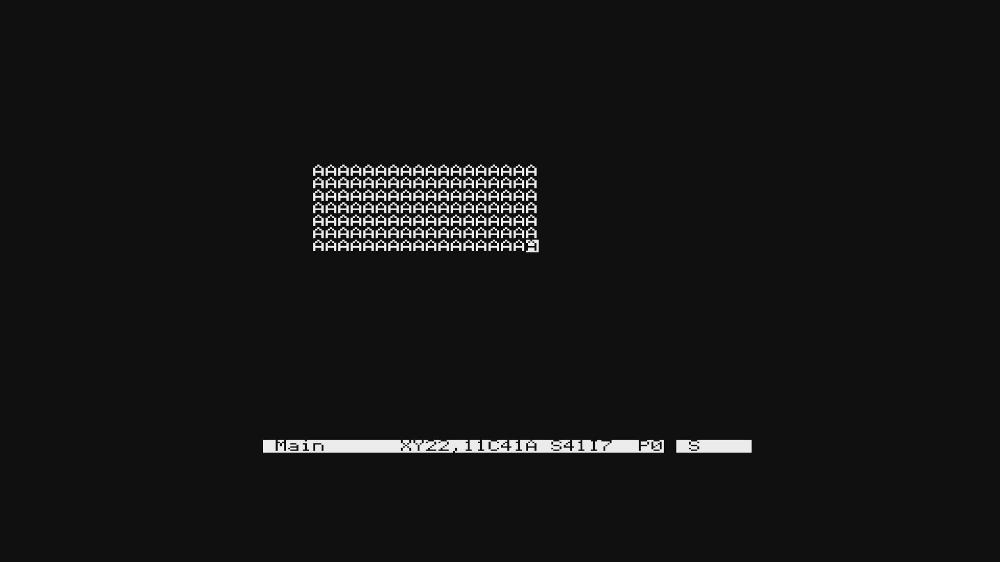

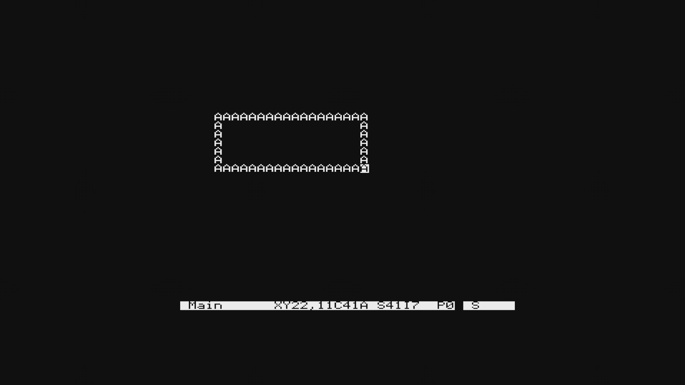

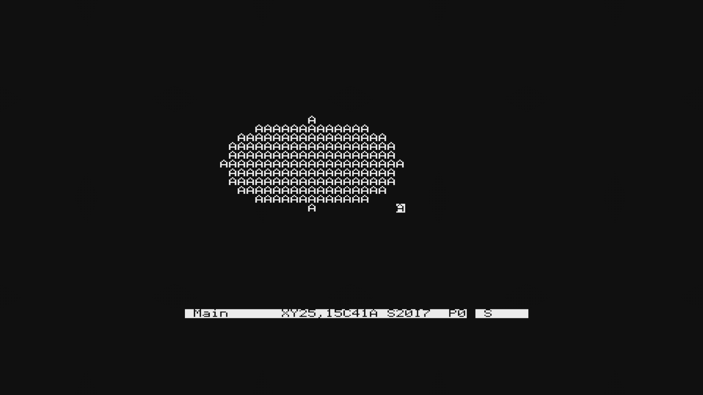

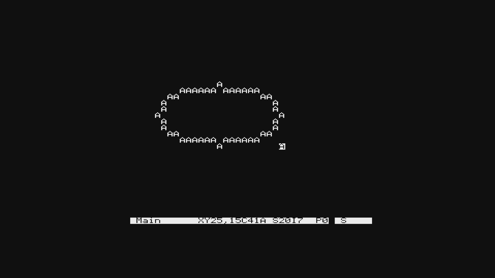

**Note on character cells and ellipses:** Oric character cells are 6 pixels wide × 8 pixels tall. A square bounding box therefore produces a visually flattened ellipse, not a circle. Widen the box if you want a rounder result.

|Key|Description
|---|---|
|**Cursor keys**|Expand/shrink in the selected direction (phase 1)
|**O**|Toggle filled/hollow (phase 2)
|**C**|Toggle rectangle/ellipse (phase 2)
|**RETURN**|Accept (both phases)
|**ESC**|Cancel and go back to main mode
|**FUNCT+6**|Toggle statusbar visibility
|**FUNCT+8**|Help screen

## Write mode
([Back to contents](#contents))

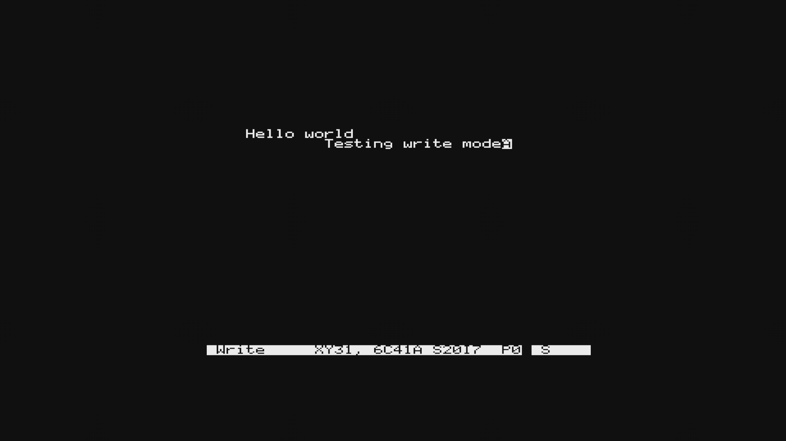

Pressing **W** in main mode enters Write mode. Type characters freely with the keyboard — any printable key (screencode > 32) plots the character at the cursor and advances one cell to the right.

Colors and attributes can be set and plotted while typing:

- **CTRL+Z** / **CTRL+X** — decrease / increase ink color
- **CTRL+C** / **CTRL+V** — decrease / increase paper color
- **CTRL+B** / **CTRL+A** / **CTRL+D** — toggle blink / alternate charset / double height
- **CTRL+R** — toggle reverse video (XOR screencode with 128)
- **FUNCT+1** — plot an ink modifier for the current ink color
- **FUNCT+2** — plot a paper modifier for the current paper color
- **FUNCT+3** — plot a character-set modifier for the current charset/double/blink settings
- **FUNCT+4** — hex-direct attribute entry: choose **1** Ink / **2** Paper / **3** Modifier, then type a single hex digit 0–7. Useful when you already know the exact value you want and do not want to cycle with CTRL+Z/X/C/V.

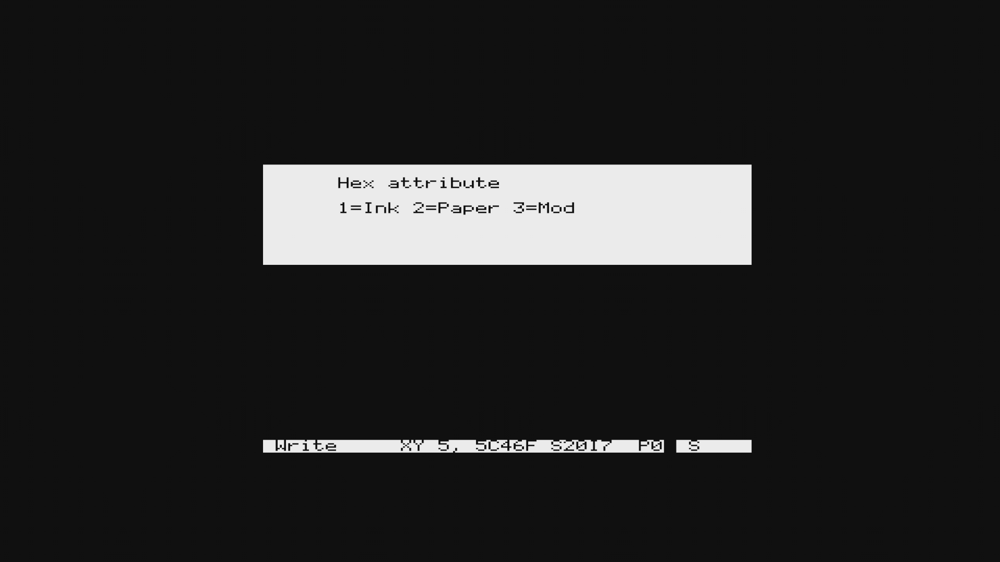

**DEL** moves the cursor one cell left and clears that cell (backspace-style). It does not wrap to the previous row.

Leave Write mode with **ESC**. **FUNCT+8** shows the help screen for this mode.

|Key|Description
|---|---|
|**Cursor keys**|Move cursor (with auto-scroll)
|**DEL**|Move left and clear that cell (backspace)
|**CTRL+A**|Toggle alternate charset attribute
|**CTRL+B**|Toggle blink attribute
|**CTRL+D**|Toggle double height attribute
|**CTRL+R**|Toggle reverse video
|**CTRL+Z**|Decrease ink color
|**CTRL+X**|Increase ink color
|**CTRL+C**|Decrease paper color
|**CTRL+V**|Increase paper color
|**FUNCT+1**|Plot ink modifier
|**FUNCT+2**|Plot paper modifier
|**FUNCT+3**|Plot character-set modifier
|**FUNCT+4**|Hex-direct attribute entry
|**ESC**|Return to main mode
|**FUNCT+6**|Toggle statusbar visibility
|**FUNCT+8**|Help screen
|**Other printable keys**|Plot corresponding character and advance right

## Color value reference
([Back to contents](#contents))

The Oric uses 3-bit RGB color values (Red bit 0, Green bit 1, Blue bit 2):

|Number|Color|B-G-R bits|
|---|---|---|
|0|Black|0-0-0|
|1|Red|0-0-1|
|2|Green|0-1-0|
|3|Yellow|0-1-1|
|4|Blue|1-0-0|
|5|Magenta|1-0-1|
|6|Cyan|1-1-0|
|7|White|1-1-1|

## Serial attribute code reference
([Back to contents](#contents))

The Oric does not have a separate attribute memory space. Instead, a byte in the character grid whose value is in the range 0–31 is interpreted as a serial attribute rather than a displayable character. Attributes take effect from their column to the right end of the same raster line; at the start of each new line the ULA resets ink to white and paper to black. Attributes in codes 8–15 (charset modifier) do **not** reset per line — they persist until the next charset-mode attribute byte.

Because a cell can be either a character or an attribute but not both, inserting an attribute displaces the character that was there. Screen designs with multiple colors require a column for each attribute change.

Only ink, paper, and charset-modifier attributes are fully supported by OSE. "Video control" attributes (not commonly used) are not handled.

For full background see: https://osdk.org/index.php?page=articles&ref=ART9

*Codes 0–7: Change ink*

|Code|Hex|Ink color|
|---|---|---|
|0|$00|Black|
|1|$01|Red|
|2|$02|Green|
|3|$03|Yellow|
|4|$04|Blue|
|5|$05|Magenta|
|6|$06|Cyan|
|7|$07|White|

Bit pattern: `0 0 0 0 0 Blue Green Red`

*Codes 8–15: Character set modifier*

Bit 3 set. Bits 0–2 control Alternate charset (bit 0), Double height (bit 1), and Blink (bit 2).

|Code|Hex|Effect|
|---|---|---|
|8|$08|Standard charset, no double, no blink|
|9|$09|Alternate charset|
|10|$0A|Standard, double height|
|11|$0B|Alternate, double height|
|12|$0C|Standard, blink|
|13|$0D|Alternate, blink|
|14|$0E|Standard, double height, blink|
|15|$0F|Alternate, double height, blink|

*Codes 16–23: Change paper*

Bit 4 set. Bits 0–2 are the RGB value (same as ink).

|Code|Hex|Paper color|
|---|---|---|
|16|$10|Black|
|17|$11|Red|
|18|$12|Green|
|19|$13|Yellow|
|20|$14|Blue|
|21|$15|Magenta|
|22|$16|Cyan|
|23|$17|White|

## File format reference
([Back to contents](#contents))

All file formats used by OSE-LOCI are headerless binary dumps — no magic bytes, no metadata, no padding. Files are read and written directly to the relevant Oric memory addresses. The one exception is `PJ.BIN` (project header), which carries a `FILEIO_MAGIC` sentinel (`$4F53`) so the V1 format can be auto-detected.

### Screen (`<name>.BIN` — File > Save/Load Screen)

A flat raw dump of `screenmap[]`.

| Offset | Size | Content |
|--------|------|---------|
| 0 | width × height bytes | Canvas screencodes, row-major (top to bottom) |

No header: width and height are not stored in the file — Load screen asks you to enter them. A standard 40×28 screen = 1,120 bytes. Any canvas size is valid.

### Combined (`<name>.BIN` — File > Save/Load Combined)

A memory-map dump covering both charset banks and the canvas. Only **40×28** and **40×27** canvases are accepted (other dimensions are rejected). Load auto-detects height from file size.

| Offset | Size | Load address | Content |
|--------|------|-------------|---------|
| 0 | 768 | $B500–$B7FF | Standard charset displayable range (codes $20–$7F, 96 glyphs × 8 bytes) |
| 768 | 256 | $B800–$B8FF | Alternate charset non-displayable prefix (codes $00–$1F) |
| 1,024 | 640 | $B900–$BB7F | Alternate charset displayable range (codes $20–$6F, 80 glyphs × 8 bytes) |
| 1,664 | 40 × height | $BB80+ | Canvas screencodes, row-major |

Total: **2,784 bytes** (40×28) or **2,744 bytes** (40×27).

### Project (four files — File > Save/Load Project)

| File | Size | Content |
|------|------|---------|
| `<name>PJ.BIN` | 22 bytes | `ProjectHeader`: canvas size, cursor/offset positions, plot attributes, `stdchanged`/`altchanged` flags, `FILEIO_MAGIC` sentinel ($4F53) |
| `<name>SC.BIN` | width × height bytes | Canvas screencodes (bare, no header; size from PJ.BIN) |
| `<name>CS.BIN` | 768 bytes | Standard charset displayable range (written/read only if `stdchanged` is set) |
| `<name>CA.BIN` | 640 bytes | Alternate charset displayable range, codes $20–$6F (written/read only if `altchanged` is set) |

V1 (CC65 version) project files use a 19-byte header format, auto-detected via the magic field (V1's first two bytes can never equal $4F53).

### Charset files (Charset menu)

| Format | File | Size | Content |
|--------|------|------|---------|
| Standard | `<name>.BIN` | 768 bytes | CHARSET_STD displayable range, $B500–$B7FF |
| Alternate | `<name>.BIN` | 640 bytes | CHARSET_ALT displayable range, $B900–$BB7F (codes $20–$6F only; codes $70–$7F overlap screen RAM) |
| Combined | `<name>.BIN` | 1,664 bytes | Same layout as File > Combined but without the screen: 768 bytes Std + 256 bytes Alt non-displayable prefix + 640 bytes Alt displayable. Both banks loaded/saved together. |

## Credits
([Back to contents](#contents))

Oric Screen Editor for LOCI

Screen editor for the Oric Atmos

OSE-LOCI written in 2024–2026 by Xander Mol

Based on OricScreenEditor V1 (2022) by Xander Mol

https://github.com/xahmol/OricScreenEditorLOCI

https://www.idreamtin8bits.com/

Code and resources from others used:

-   **Oscar64** cross-compiler by drmortalwombat (6502 C compiler used for this project)

    https://github.com/drmortalwombat/oscar64

-   **LOCI mass-storage ROM and hardware** by Sodiumlightbaby and sodiumlb

    https://github.com/sodiumlb/loci-rom
    https://github.com/sodiumlb/loci-hardware

-   **Phosphoric Oric emulator** by benedictemarty (used for the automated test suite)

    https://github.com/benedictemarty/Phosphoric

-   **Raxiss IJK joystick driver** from oricOpenLibrary

    https://github.com/iss000/oricOpenLibrary

-   **jab / Artline Designs (Jaakko Luoto)** for inspiration for the Palette visual charmap mode

-   **Bart van Leeuwen and forum.defence-force.org** for inspiration and advice

-   Tested on real Oric Atmos hardware with LOCI, and with Phosphoric and Oricutron emulators

The code can be used freely as long as you retain
a notice describing the original source and author.

THE PROGRAMS ARE DISTRIBUTED IN THE HOPE THAT THEY WILL BE USEFUL,
BUT WITHOUT ANY WARRANTY. USE THEM AT YOUR OWN RISK!

([Back to contents](#contents))
