# Oric Screen Editor pour LOCI
Éditeur d'écran pour l'Oric Atmos — réécriture Oscar64 avec support de stockage de masse LOCI

## Sommaire

[Historique des versions et téléchargement](#historique-des-versions-et-téléchargement)

[Introduction](#introduction)

[Démarrage du programme](#démarrage-du-programme)

[Compilation depuis les sources](#compilation-depuis-les-sources)

[Mode principal](#mode-principal)

[Barre d'état](#barre-détat)

[Menu principal](#menu-principal)

[Éditeur de caractères](#éditeur-de-caractères)

[Mode palette](#mode-palette)

[Sélecteur de couleurs](#sélecteur-de-couleurs)

[Mode sélection](#mode-sélection)

[Mode déplacement](#mode-déplacement)

[Mode ligne et boîte](#mode-ligne-et-boîte)

[Mode écriture](#mode-écriture)

[Référence des valeurs de couleur](#référence-des-valeurs-de-couleur)

[Référence des codes d'attribut série](#référence-des-codes-dattribut-série)

[Référence du format de fichier](#référence-du-format-de-fichier)

[Crédits](#crédits)


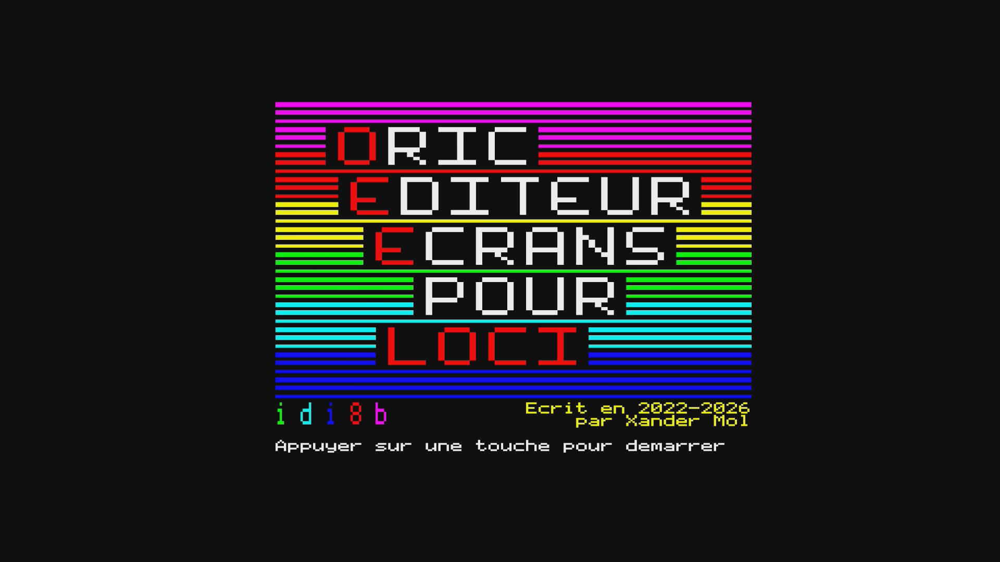

## Historique des versions et téléchargement
([Retour au sommaire](#sommaire))

Lien vers la dernière version publiée :
https://github.com/xahmol/OricScreenEditorLOCI/releases/latest

Version v1.0.0 (première version publique) :

- Réécriture complète en C Oscar64 pour l'Oric Atmos 6502A bare-metal
- **Périphérique de stockage de masse LOCI requis** — la zone de dessin réside en RAM d'extension ; tous les accès fichiers sont via LOCI
- Localisation complète : versions anglaise (`oseloci.tap`) et française (`oseloci_fr.tap`), chacune avec son propre écran-titre et ses écrans d'aide
- Annuler/Rétablir les modifications de la zone de dessin (jusqu'à 40 niveaux, stockés en RAM d'extension)
- Navigateur de fichiers basé sur la XRAM LOCI, avec exploration complète du système de fichiers
- Formats Sauver/Charger Ecran, Projet (4 fichiers), Combiné (2 jeux + écran), et Jeux de caractères ; compatibilité avec les projets V1
- Éditeur de caractères : modifications directes en RAM charset en temps réel, saisie hexadécimale par ligne, annulation locale
- Mécanisme de protection du chrome des popups contre les glyphes redéfinis par l'utilisateur
- Sélecteur de couleurs pour choisir encre et papier visuellement
- Support du joystick IJK (interface Raxiss), détecté automatiquement
- Mode Essai, Aller à/Origine, Rechercher/Remplacer, boite creuse + ellipse en mode Ligne et boîte
- Jeu de caractères > Reinitialiser Standard→ROM et Reinitialiser Alt→Boot
- Saisie hexadécimale directe d'attribut en mode Écriture (FUNCT+4)
- Suite de tests automatisés Phosphoric : 200/200 tests reussis

## Introduction
([Retour au sommaire](#sommaire))

Oric Screen Editor pour LOCI (OSE-LOCI) est un éditeur d'écran pour l'Oric Atmos, prenant entièrement en charge les jeux de caractères personnalisés, réécrit de zéro en C Oscar64. Il est basé sur [OricScreenEditor V1](https://github.com/xahmol/OricScreenEditor) (la version originale CC65) et l'étend avec le support du stockage de masse LOCI, l'annulation/rétablissement des modifications, et de nombreuses nouvelles fonctionnalités d'édition.

**Un périphérique de stockage de masse LOCI est requis pour utiliser le programme.** La zone de dessin elle-même réside en RAM d'extension activée par LOCI ($C000–$E7FF), pas seulement le chargement et la sauvegarde de fichiers. Si aucun périphérique LOCI n'est détecté au démarrage, le programme affiche un message et se termine au lieu de démarrer l'éditeur.

Principales fonctionnalités :

- Prise en charge de zones de dessin plus grandes que 40×28 caractères. Toute taille de 1×1 vers le haut est prise en charge, jusqu'à un maximum de 10 Kio (10 240 octets). La largeur et la hauteur ne sont pas limitées à la fenêtre visible de 40×28 — l'éditeur fait défiler automatiquement quand le curseur atteint un bord.
- Redimensionner, effacer ou remplir la zone de dessin à tout moment via le menu Ecran
- Accès complet aux fichiers LOCI avec un navigateur XRAM prenant en charge l'exploration complète du système de fichiers. Formats Sauver/Charger Ecran, Projet, Combiné, et Jeux de caractères. Sauvegarde des deux banques de jeux de caractères quand modifiées.
- Éditeur de caractères (popup latérale) pour modifier les glyphes en direct — les modifications s'appliquent directement à la RAM charset et mettent à jour toutes les cellules de la zone de dessin utilisant ce glyphe en temps réel
- Prise en charge des attributs sériels Oric : encre, papier et modificateurs de jeu de caractères (standard ou alternatif, double hauteur, clignotement)
- Annuler/Rétablir les modifications de la zone de dessin (**Z**/**Y**) sauvegardés en RAM d'extension, jusqu'à 40 niveaux
- Mode écriture pour saisir librement du texte avec le clavier complet
- Mode ligne et boîte : boite pleine, boite creuse, ellipse pleine ou creuse inscrite dans le rectangle englobant
- Mode sélection : délimiter un rectangle, puis couper, copier, supprimer ou remplir avec un attribut encre/papier/modificateur
- Mode déplacement : faire défiler le contenu de la fenêtre visible
- Mode palette avec option de plan de caractères visuel pour le jeu alternatif
- Sélecteur de couleurs pour choisir ensemble les couleurs encre et papier sur une grille visuelle
- Emplacements favoris pour 10 caractères fréquemment utilisés
- **Support du joystick IJK** (interface Raxiss IJK) — détecté automatiquement au démarrage, fonctionne en parallèle avec le clavier partout où les touches curseur et ENTRÉE sont utilisées
- **Mode Essai** (**T**) : prévisualiser un caractère sans le valider ; ESPACE confirme, toute autre touche annule
- **Aller à** (**J**) : ouvrir une popup pour déplacer le curseur et la vue vers n'importe quelle coordonnée saisie
- **Origine** (**H**) : revenir directement à l'origine (0,0) de la zone de dessin sans popup
- **Rechercher/Remplacer** (**F**) pour les codes écran et les couleurs encre/papier dans toute la zone de dessin
- Bascules boîte creuse et ellipse en mode Ligne et boîte (**O**, **C**)
- **Jeux de caractères > Reinitialiser Standard→ROM** et **Reinitialiser Alt→Boot**
- **Saisie hexadécimale directe d'attribut** en mode Écriture (**FUNCT+4**)
- Disponible en anglais et en français (écran-titre et écrans d'aide localisés)

## Démarrage du programme
([Retour au sommaire](#sommaire))

**Prérequis :** un Oric Atmos avec un périphérique de stockage de masse LOCI connecté. L'éditeur ne démarrera pas sans lui — si aucun LOCI n'est détecté, il affiche un message et se termine.

**Installation :**

1. Téléchargez le dernier ZIP de version depuis la [page des versions publiées](https://github.com/xahmol/OricScreenEditorLOCI/releases/latest).

2. Décompressez tout le contenu dans un seul dossier sur la carte SD du périphérique LOCI. Vous pouvez choisir n'importe quel nom de dossier. Le programme charge ses fichiers d'assets (écran-titre, écrans d'aide) relativement au dossier depuis lequel il a été lancé, donc tous les fichiers doivent être dans le même dossier.

3. Utilisez l'interface LOCI pour naviguer jusqu'au dossier et lancer le fichier `.tap` dans la langue souhaitée :
   - `oseloci.tap` — version anglaise
   - `oseloci_fr.tap` — version française

   Pour les instructions sur la navigation dans les dossiers et le lancement de fichiers `.tap` avec le matériel LOCI, consultez le [Manuel utilisateur LOCI](https://github.com/sodiumlb/loci-hardware/wiki/LOCI-User-Manual).

**Fichiers inclus dans le ZIP de version :**

| Nom de fichier | Description |
|---|---|
| `oseloci.tap` | Programme principal — anglais |
| `oseloci_fr.tap` | Programme principal — français |
| `OSETSC.BIN` | Ecran-titre (EN) |
| `OSETSF.BIN` | Ecran-titre (FR) |
| `OSEHS1.BIN`–`OSEHS4.BIN` | Ecrans d'aide EN : mode principal / editeur de caracteres / selection+deplacement+ligne-boite / ecriture |
| `OSEHF1.BIN`–`OSEHF4.BIN` | Ecrans d'aide FR |
| `PETSCIIPJ/SC/CS/CA.BIN` | Projet demo : art PETSCII (issu d'OricScreenEditor V1) |
| `OSEDEMOPJ/SC/CS/CA.BIN` | Projet demo : echantillons de couleurs + soleil en pixel-art |
| `OSEDEMO.BIN` | Meme demo au format Combine (Fichier > Charger combine) |
| `OSELOGOPJ/SC/CS/CA.BIN` | Projet demo : logo de la societe Oric en glyphes dessines a la main |
| `LUDOTITLPJ/SC/CS/CA.BIN` | Projet demo : ecran-titre du jeu Ludo |
| `LUDOSCRMPJ/SC/CS/CA.BIN` | Projet demo : ecran de jeu Ludo |
| `README.pdf` | Ce manuel (EN) |
| `README_fr.pdf` | Ce manuel (FR) |

Tous les projets demo sont chargeables via **Fichier > Charger projet**. `OSEDEMO.BIN` est egalement chargeable via **Fichier > Charger combine**.

Quittez l'écran-titre en appuyant sur n'importe quelle touche. L'éditeur démarre en mode principal.

## Compilation depuis les sources
([Retour au sommaire](#sommaire))

**Prérequis :**

- Compilateur [Oscar64](https://github.com/drmortalwombat/oscar64). Définissez `OSCAR64_HOME` sur le dossier d'installation (par défaut : `~/oscar64`).
- Python 3 (pour l'outil `mktap.py` d'encapsulation en tape).
- GNU Make.
- Optionnel : `pandoc` + `texlive-xetex` pour régénérer les PDF (`make docs`).
- Optionnel : émulateur [Phosphoric](https://github.com/benedictemarty/Phosphoric) pour la suite de tests automatisés (`make test`).

**Compilation :**

```
git clone https://github.com/xahmol/OricScreenEditorLOCI.git
cd OricScreenEditorLOCI
make              # version EN → build/oseloci.tap
make LANG=FR      # version FR → build/oseloci_fr.tap
make all-langs    # les deux versions
make docs         # regénérer README.pdf / README_fr.pdf
make zip          # créer le ZIP de distribution (les deux .tap + tous les assets + les READMEs)
```

**Copie vers un périphérique LOCI :**

1. Copiez `.env.example` vers `.env` et définissez `USBPATH` vers le dossier cible sur la carte SD LOCI.
2. Lancez `make usb` — compile les deux versions, puis copie tous les fichiers `.tap` et `.BIN` d'assets vers `USBPATH`.

## Mode principal
([Retour au sommaire](#sommaire))

Après l'écran-titre, le programme démarre dans ce mode. Un curseur inversé affichant le code écran actuellement sélectionné est visible à l'origine de la zone de dessin.

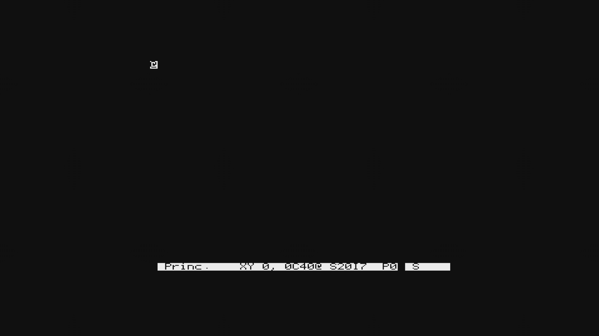

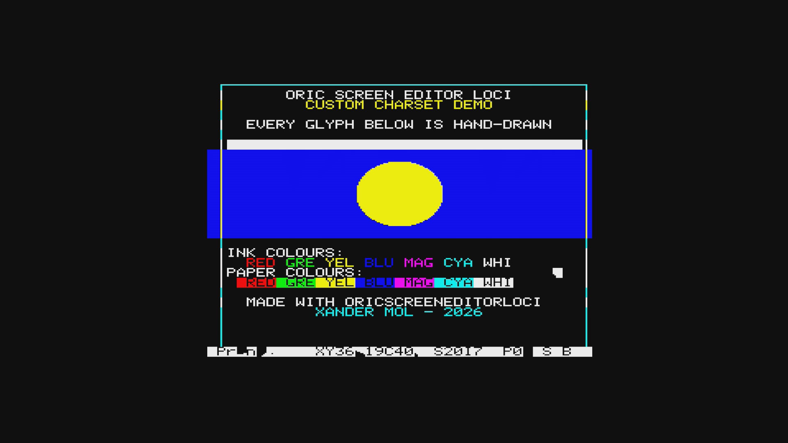

Appuyez sur ces touches en mode principal pour l'édition :

|Touche|Description
|---|---|
|**Touches curseur**|Déplacer le curseur (fait défiler la vue si la zone de dessin est plus grande que 40×28)
|**+** ou **=**|Caractère suivant (augmente le code écran)
|**-**|Caractère précédent (diminue le code écran)
|**0-9**|Sélectionner le caractère de l'emplacement favori correspondant
|**SHIFT + 0-9**|Enregistrer le caractère dans l'emplacement favori correspondant
|**,**|Encre précédente (diminue le numéro de couleur)
|**.**|Encre suivante (augmente le numéro de couleur)
|**;**|Diminuer le papier (diminue le numéro de couleur)
|**\'**|Augmenter le papier (augmente le numéro de couleur)
|**ESPACE**|Tracer avec le code écran et les attributs actuels
|**DEL**|Effacer la position actuelle du curseur (trace un espace blanc)
|**B**|Basculer l'attribut clignotement (**B**link)
|**A**|Basculer entre le jeu de caractères **A**lternatif et Standard
|**D**|Basculer l'attribut double hauteur (**D**ouble)
|**I**|Tracer un modificateur **I**nk (encre) pour la couleur d'encre actuellement sélectionnée
|**O**|Tracer un modificateur Paper (papier) pour la couleur de papier actuellement sélectionnée
|**U**|Tracer un modificateur de jeu de caractères pour la sélection actuelle de jeu/double/clignotement
|**E**|Aller au mode '**É**dition de caractère' avec le code écran actuel
|**G**|Récupérer (**G**rab) le caractère ou l'attribut sous le curseur
|**W**|Aller au mode '**É**criture' (**W**rite)
|**L**|Aller au mode '**L**igne et boîte'
|**M**|Aller au mode 'Déplace**m**ent' (**M**ove)
|**S**|Aller au mode '**S**élection'
|**P**|Aller au mode '**P**alette'
|**C**|Aller au sélecteur de couleurs (**C**olour picker)
|**T**|Mode d'essai (**T**ry) — prévisualiser le caractère actuel sans le valider
|**R**|Basculer la vidéo inversée (**R**everse) : XOR du code écran avec 128
|**J**|Aller à (**J**ump) — déplacer le curseur et la vue vers une coordonnée X/Y saisie
|**H**|Origine (**H**ome) — revenir à l'origine (0,0) de la zone de dessin
|**F**|Rechercher/Remplacer (**F**ind) un code écran ou une couleur encre/papier
|**Z**|Annuler la dernière modification de la zone de dessin
|**Y**|Rétablir la dernière modification annulée
|**FUNCT+1**|Aller au menu principal
|**FUNCT+6**|Basculer la visibilité de la barre d'état
|**FUNCT+8**|Écran d'aide

**NB :** Dans Oricutron avec la configuration clavier par défaut, la touche FUNCT est associée à la touche ALT du clavier PC.

*Déplacer le curseur*

Appuyez sur les **touches curseur** pour déplacer le curseur sur l'écran. Si la zone de dessin est plus grande que la fenêtre de 40×28, l'écran défile automatiquement lorsque le curseur atteint un bord.

*Sélectionner le code écran à tracer*

La touche **+** ou **=** augmente le code écran sélectionné de un ; **-** le diminue. Le curseur se met à jour pour afficher le code écran actuellement sélectionné.

Appuyer sur **R** effectue un XOR du code écran avec 128, activant/désactivant le bit de vidéo inversée.

*Sélectionner les codes écran depuis un emplacement favori*

Dix emplacements favoris sont disponibles. Appuyer sur **0-9** sélectionne le favori correspondant ; **SHIFT+0-9** y stocke le caractère actuellement sélectionné.

*Sélectionner les attributs à tracer*

Augmentez ou diminuez la [valeur de couleur](#référence-des-valeurs-de-couleur) avec **.** / **,** pour l'encre, ou **;** / **\'** pour le papier. Appuyer sur **B**, **D** ou **A** bascule le clignotement, la double hauteur ou le jeu alternatif. Vous pouvez aussi appuyer sur **C** pour ouvrir le [sélecteur de couleurs](#sélecteur-de-couleurs) et choisir l'encre et le papier ensemble sur une grille visuelle.

*Tracer et effacer un caractère*

Appuyez sur **ESPACE** pour tracer le caractère actuellement sélectionné à la position du curseur. **DEL** remplace la cellule par un espace.

Appuyez sur **T** pour prévisualiser l'apparence du caractère sélectionné lorsque tracé. Appuyez sur **ESPACE** pour confirmer et le valider, ou sur toute autre touche pour annuler.


*Tracer des attributs sériels*

En raison de la façon dont l'Oric gère les [changements de couleur et d'attribut](#référence-des-codes-dattribut-série), chaque position d'écran est soit un modificateur d'attribut, soit un caractère — jamais les deux. Pour cette raison, tracer un caractère ne trace aucun attribut.

Appuyez sur **I** pour tracer un modificateur d'encre pour la couleur d'encre actuelle, **O** pour tracer un modificateur de papier, et **U** pour tracer un modificateur de jeu de caractères reflétant les réglages alternatif, double et clignotement actuels.

*Récupérer un caractère*

Appuyer sur **G** lit le caractère ou l'attribut à la position du curseur et met à jour les réglages de tracé : un code >31 met à jour le code écran ; un code <8 met à jour l'encre ; un code >15 met à jour le papier ; les codes 8–15 décodent les bascules jeu alternatif, double et clignotement. Le curseur se met à jour en conséquence.

*Mode édition de caractère*

Appuyez sur **E** pour entrer dans le [mode édition de caractère](#éditeur-de-caractères) pour le code écran actuellement sélectionné. Astuce : déplacez le curseur sur un caractère que vous souhaitez modifier, appuyez sur **G** pour le récupérer, puis sur **E** pour l'éditer.

*Entrer dans les modes d'édition*

Appuyez sur **S** ([Mode sélection](#mode-sélection)), **M** ([Mode déplacement](#mode-déplacement)), **L** ([Mode ligne et boîte](#mode-ligne-et-boîte)) ou **W** ([Mode écriture](#mode-écriture)) pour entrer dans le mode correspondant. Appuyez sur **ESC** dans n'importe quel mode pour revenir au mode principal.

*Aller à des coordonnées et Origine*

Appuyez sur **J** pour ouvrir une popup demandant une coordonnée X puis Y (toutes deux pré-remplies avec la position actuelle du curseur). Valider les deux déplace le curseur et la vue en une seule étape — bien plus rapide que de défiler case par case sur une zone de dessin plus grande que l'écran de 40×28. ESC à l'un ou l'autre des champs annule sans rien changer.

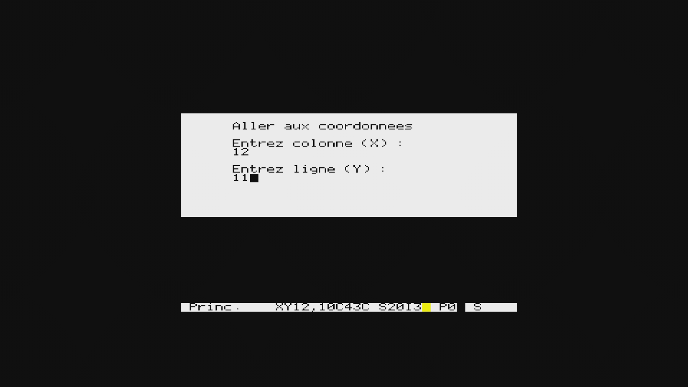

Appuyez sur **H** pour revenir directement à l'origine (0,0) de la zone de dessin, sans popup.

*Rechercher/Remplacer*

Appuyez sur **F** pour ouvrir la popup Rechercher/Remplacer. Choisissez d'abord ce qu'il faut rechercher : **1** pour un code écran, **2** pour une couleur d'encre, ou **3** pour une couleur de papier. Saisissez ensuite la valeur à rechercher (un code écran hexadécimal, ou un numéro de couleur 0–7). Enfin :
- Appuyez sur **ENTRÉE** avec une valeur de remplacement pour remplacer toutes les occurrences dans toute la zone de dessin (annulable ensuite avec **Z**).
- Appuyez sur **ESC** à l'étape de remplacement pour déplacer le curseur jusqu'à la prochaine occurrence sans modifier la zone de dessin.

ESC aux deux premières étapes annule toute l'opération.

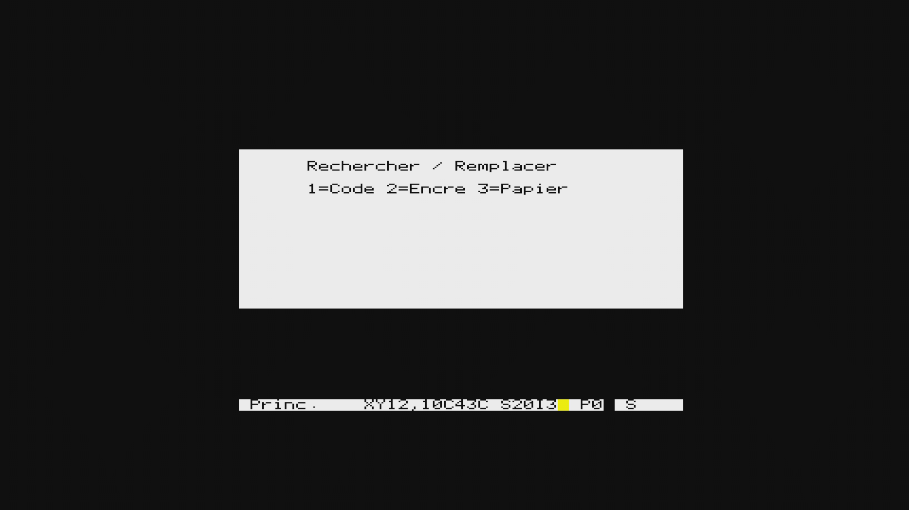

*Annuler et rétablir*

Appuyez sur **Z** pour annuler la dernière modification de la zone de dessin (tracé, Ligne/Boîte, remplissages/couper/copier de Sélection, Déplacement, mode Écriture, ou Ecran > Effacer/Remplir), et **Y** pour rétablir. L'historique est stocké en RAM d'extension ($E800–$FFFF, 6 Kio), jusqu'à 40 niveaux. Ecran > Effacer/Remplir sur une zone de dessin de plus de 6 Kio n'est explicitement pas annulable.

*Basculer la visibilité de la barre d'état*

Appuyez sur **FUNCT+6** pour basculer la barre d'état dans n'importe quel mode.

*Écran d'aide*

Appuyez sur **FUNCT+8** pour afficher un écran d'aide avec toutes les commandes clavier du mode actuel.

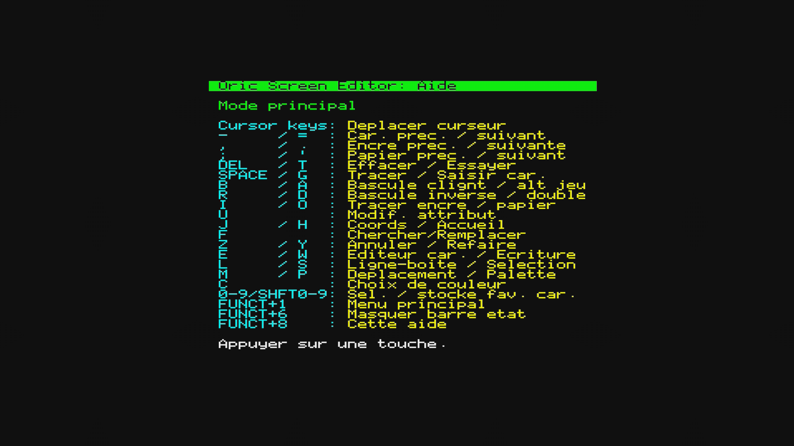

## Barre d'état
([Retour au sommaire](#sommaire))

Si elle est activée, la barre d'état occupe la dernière ligne de l'écran (ligne 27). Elle se masque automatiquement quand le curseur se déplace sur cette ligne (affichant à la place le contenu réel de la zone de dessin à cet endroit), et réapparaît quand le curseur s'éloigne.


De gauche à droite :

- **Mode** : mode actuel (Principal, Sélection, Ligne/Boîte, Palette, Éditeur de caractères, etc.)
- **X,Y** : coordonnées absolues du curseur sur la zone de dessin (depuis l'origine, pas depuis la fenêtre visible). Affichées en décimal ; passe en hexadécimal si l'une des dimensions de la zone de dessin dépasse 99.
- **C** : code écran sélectionné — valeur numérique (hex) puis caractère visuel
- **S** : octet en mémoire à la position du curseur — code de caractère (>$20) ou code d'attribut (<$20), en hex
- **I** : couleur d'encre sélectionnée — numéro 0–7, puis échantillon de couleur
- **P** : couleur de papier sélectionnée — numéro 0–7, puis échantillon de couleur
- **A / S** : bascule jeu de caractères alternatif (A=Alt, S=Std)
- **D / _** : bascule double hauteur
- **B / _** : bascule clignotement

Appuyer sur **FUNCT+6** bascule la visibilité de la barre d'état dans tous les modes.

## Menu principal
([Retour au sommaire](#sommaire))

Depuis le mode principal, appuyez sur **FUNCT+1** pour ouvrir la barre de menus. Navigation :

|Touche|Description
|---|---|
|**Curseur GAUCHE / DROITE**|Se déplacer entre les entrées de la barre de menus
|**Curseur HAUT / BAS**|Se déplacer entre les options du menu déroulant
|**RETURN**|Sélectionner l'option en surbrillance
|**ESC**|Quitter le menu et revenir en arrière

(Note : si la zone de dessin utilise un jeu de caractères modifié, le programme restaure temporairement la police ROM pendant l'ouverture du menu, afin que le chrome des popups s'affiche correctement. Votre zone de dessin est restaurée à la fermeture du menu — c'est le mécanisme d'échange de jeux de caractères.)

**_Menu Ecran_**

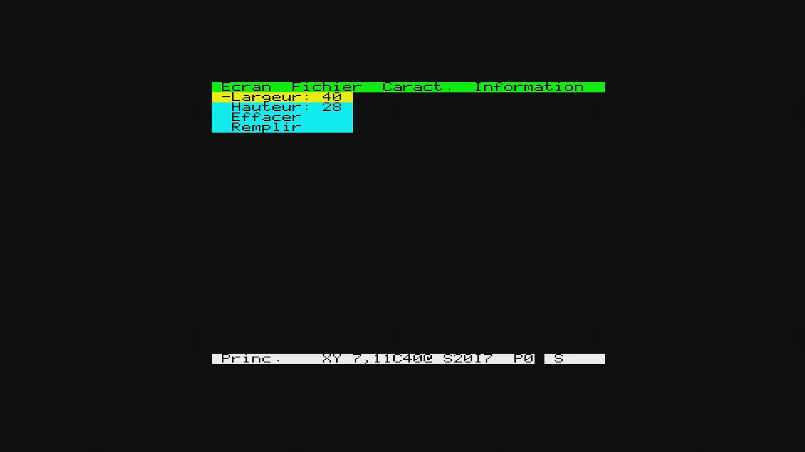

*Width : redimensionner la largeur*

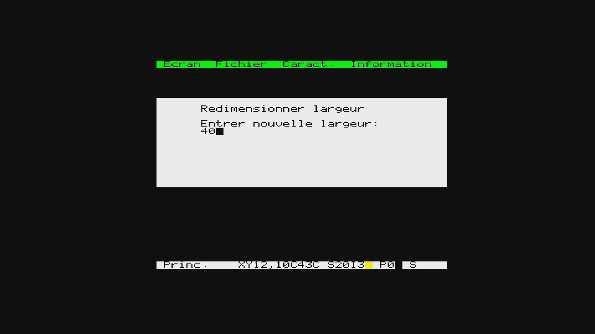

Redimensionnez la largeur de la zone de dessin en saisissant la nouvelle valeur. Toute largeur à partir de 1 est acceptée, sous réserve que largeur×hauteur ne dépasse pas 10 240 octets. Réduire en dessous de la largeur actuelle supprime les colonnes à droite de la nouvelle limite ; une boîte de dialogue de confirmation apparaît avant de réduire.

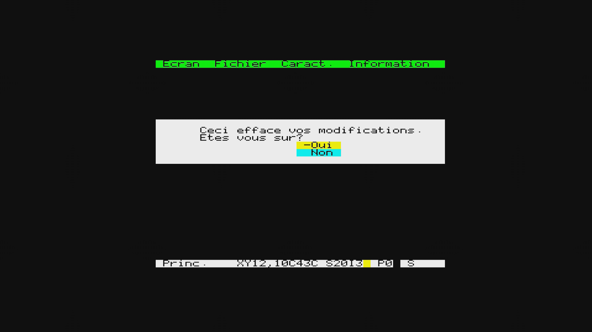

*Height : redimensionner la hauteur*

Identique pour la hauteur. Toute hauteur à partir de 1, même limite totale. Après redimensionnement, la vue est recentrée sur (0,0).

*Clear : effacer la zone de dessin*

Remplit toute la zone de dessin avec des espaces et réinitialise les attributs encre/papier dans les deux premières colonnes de chaque ligne avec les valeurs actuellement sélectionnées. Annulable avec **Z** uniquement si la zone de dessin fait 6 Kio ou moins.

*Fill : remplir la zone de dessin*

Comme Effacer, mais remplit avec le code écran actuellement sélectionné plutôt qu'un espace. Même limite d'annulation.

**_Menu Fichier_**

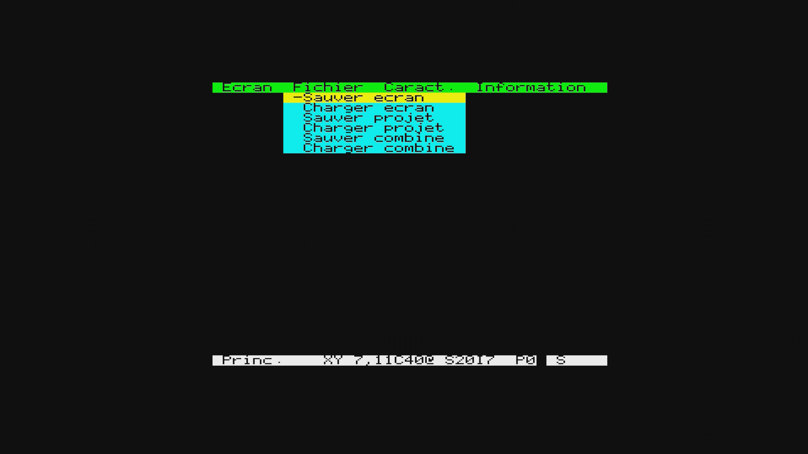

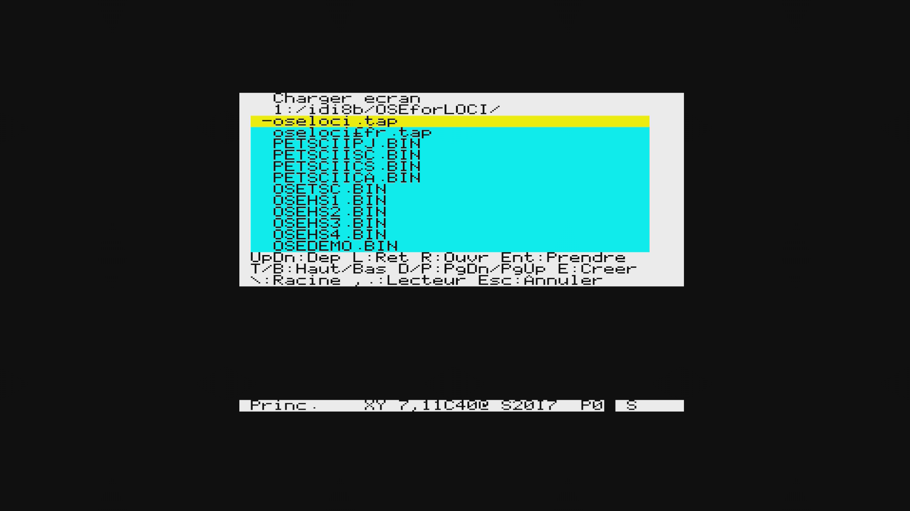

Toutes les actions du menu Fichier utilisent le **périphérique de stockage de masse LOCI** — pas de commandes cassette. Les actions de sauvegarde et de chargement ouvrent toutes les deux le même navigateur de fichiers basé sur la XRAM LOCI.

**Les actions de sauvegarde** présentent une entrée `<nouveau fichier>` en haut de la liste, suivie des fichiers existants. Appuyez sur ENTRÉE sur `<nouveau fichier>` pour saisir un nouveau nom de fichier (48 caractères maximum) ; appuyez sur ENTRÉE sur un fichier existant pour l'écraser (avec une confirmation).

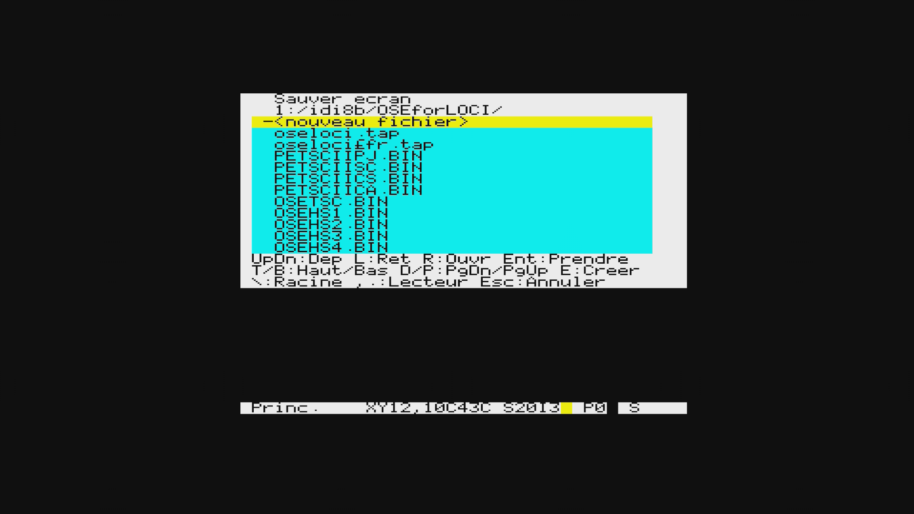

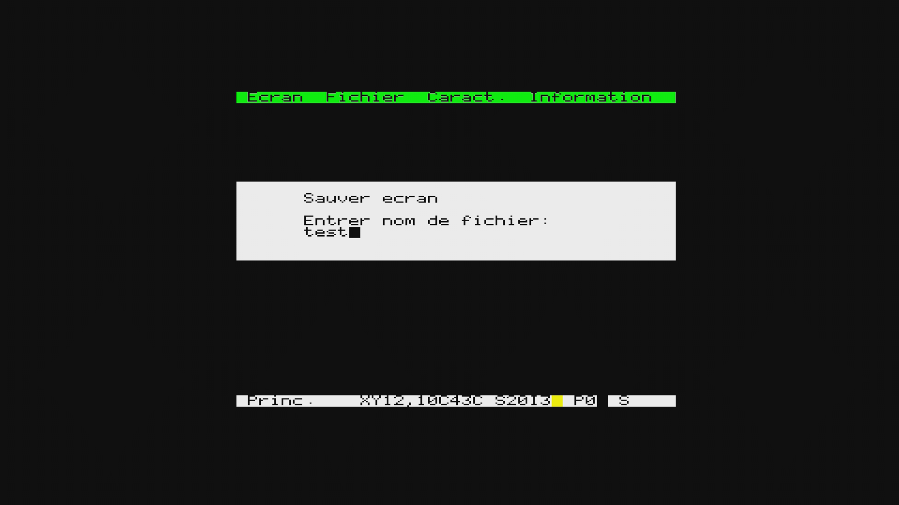

**Les actions de chargement** permettent de naviguer et sélectionner directement le fichier dans la liste. Charger projet n'affiche que les fichiers de projet (`*PJ.BIN`) ; toutes les autres actions de chargement (Ecran, Combiné, Jeux de caractères) affichent tous les fichiers du dossier sans filtrage.

Le navigateur de fichiers permet d'explorer tout le système de fichiers :

|Touche|Description
|---|---|
|**Curseur HAUT/BAS**|Déplacer la surbrillance
|**Curseur GAUCHE**|Remonter au dossier parent
|**Curseur DROITE / ENTRÉE**|Entrer dans le dossier en surbrillance
|**ENTRÉE**|Sélectionner le fichier en surbrillance (chargement) ou confirmer l'écrasement (sauvegarde)
|**T**|Aller au début de la liste
|**B**|Aller à la fin de la liste
|**D**|Page suivante
|**P**|Page précédente
|**\\**|Aller à la racine du lecteur actuel
|**. / ,**|Changer de lecteur suivant/précédent (0–9, en sautant les lecteurs absents)
|**E**|Créer un nouveau sous-dossier ici
|**FUNCT+6**|Basculer la barre d'état
|**ESC**|Annuler et revenir en arrière

Copier, renommer et supprimer des fichiers/dossiers ne sont pas pris en charge — utilisez un outil compatible LOCI sur l'ordinateur hôte pour ces opérations.

*Sauver/Charger écran*

Sauvegarde ou charge uniquement la zone de dessin (sans les jeux de caractères) sous `<nomfichier>.BIN` sur le périphérique LOCI : un simple dump des données d'écran sans en-tête ni métadonnées — identique à V1 pour la portabilité. Comme il n'y a pas d'en-tête, Charger écran vous demande de saisir la largeur et la hauteur (pré-remplies avec la taille actuelle) avant de charger.

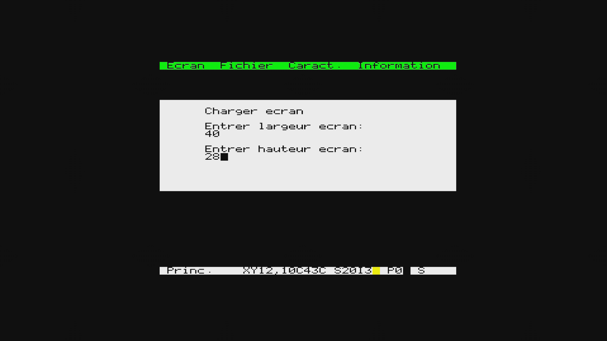

*Sauver/Charger projet*

Sauvegarde ou charge la zone de dessin avec toutes les métadonnées : position du curseur, décalages de la vue, sélections encre/papier/clignotement/double/alternatif, et — si modifiés pendant cette session — l'un ou les deux jeux de caractères. Jusqu'à quatre fichiers partagent le nom de base :

- `<nomfichier>PJ.BIN` — en-tête de projet (taille de la zone, curseur/décalages, attributs de tracé, marqueur magic)
- `<nomfichier>SC.BIN` — codes écran de la zone de dessin (brut, sans en-tête)
- `<nomfichier>CS.BIN` — jeu de caractères standard (écrit/lu uniquement si modifié cette session)
- `<nomfichier>CA.BIN` — jeu de caractères alternatif (même condition)

Charger projet détecte automatiquement la taille de la zone de dessin depuis `PJ.BIN` — pas de saisie de largeur/hauteur. Il **accepte également directement les fichiers de projet de V1** (version CC65) — le format 19 octets de V1 est détecté automatiquement via le marqueur magic.

*Sauver/Charger combiné*

Sauvegarde ou charge les deux jeux de caractères et la zone de dessin dans un seul fichier `<nomfichier>.BIN` en ordre de carte mémoire. Le canevas doit être exactement 40×28 ou 40×27 — les autres dimensions sont rejetées. Charger combiné détecte automatiquement la hauteur depuis la taille du fichier. Voir la [Référence du format de fichier](#référence-du-format-de-fichier) pour la disposition exacte.

**_Menu Caract._**

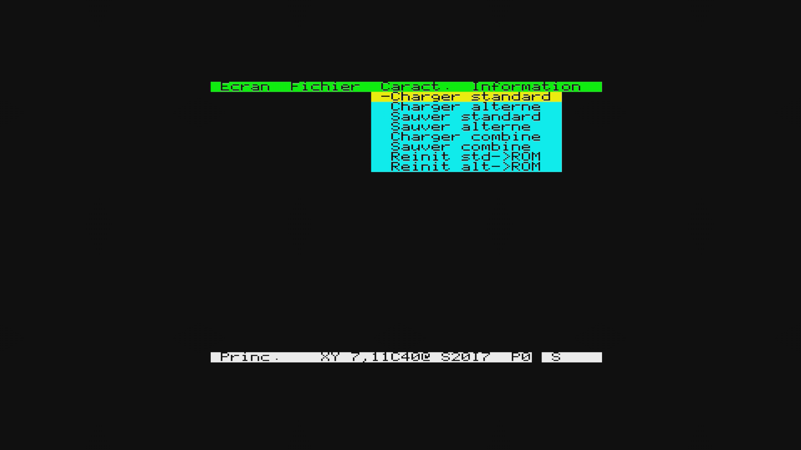

Chargez ou sauvegardez le jeu standard ou alternatif séparément (`<nomfichier>.BIN` : 768 octets pour le jeu standard, 640 octets pour le jeu alternatif — le jeu alternatif ne dispose que de 640 octets de mémoire utilisable sur l'Oric réel, le reste chevauchant la RAM écran), ou "combiné" : 768 octets standard + 256 octets préfixe non-affichable alternatif + 640 octets alternatif affichable = 1 664 octets au total. Voir la [Référence du format de fichier](#référence-du-format-de-fichier) pour la disposition exacte.

*Reinitialiser Standard→ROM*

Restaure le jeu de caractères standard depuis la police ROM de l'Oric en une seule étape, perdant toutes les modifications apportées cette session. Demande confirmation. Seul le jeu standard peut être réinitialisé ainsi — utilisez Reinitialiser Alt→Boot pour le jeu alternatif.

*Reinitialiser Alt→Boot*

Restaure le jeu de caractères alternatif (mosaïque) depuis la capture prise au démarrage du programme, perdant toutes les modifications apportées cette session. Demande confirmation. Utilise la capture du démarrage plutôt que la ROM, car l'Oric génère la police mosaïque algorithmiquement au démarrage — elle n'est pas stockée sous forme de table statique dans la ROM.

**_Menu Information_**

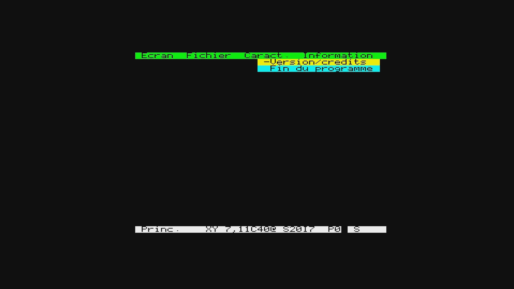

*Information*

Affiche une popup en 2 pages : une page avec le logo IDreamtIn8Bits, le numéro de version et les crédits ; suivie d'une page avec un code QR menant à la page GitHub de ce projet. Appuyez sur une touche pour avancer entre les pages, puis pour revenir au menu.

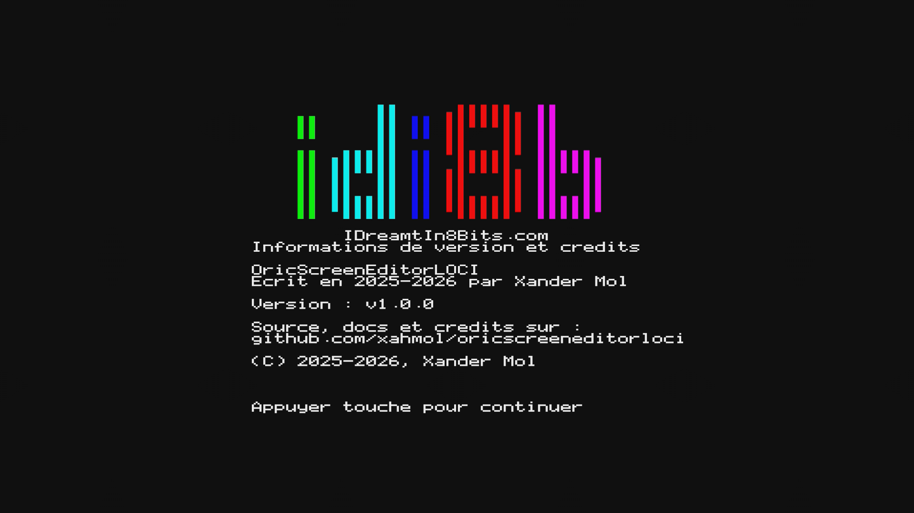

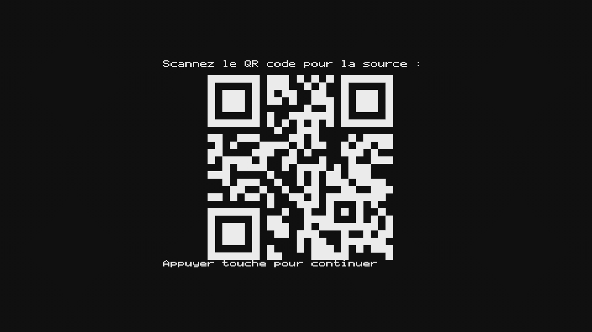

*Quitter*

Réinitialise l'Oric à son état de démarrage à froid (saut via le vecteur RESET). Aucune confirmation n'est demandée et le travail non sauvegardé sera perdu.

## Éditeur de caractères
([Retour au sommaire](#sommaire))

Appuyer sur **E** depuis le mode principal ouvre l'éditeur de caractères sous forme de popup latérale (colonnes 26–39, lignes 0–14). Le reste de la zone de dessin reste visible et continue de montrer l'effet des modifications en temps réel — les modifications s'appliquent directement à la RAM charset.

L'en-tête de la popup affiche le code écran actuel (hex) et si le jeu Standard (Std) ou Alternatif (Alt) est actif. Les lignes en dessous affichent la grille de pixels 8×6, avec la valeur hexadécimale de chaque ligne affichée immédiatement à sa gauche.

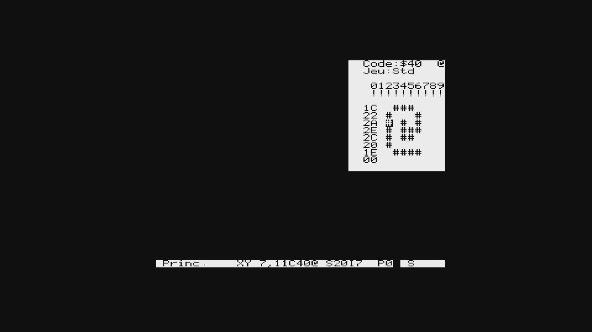

Commandes clavier dans ce mode :

|Touche|Description
|---|---|
|**Touches curseur**|Déplacer le curseur dans la grille de pixels 8×6
|**+**|Caractère suivant (augmente le code écran)
|**-**|Caractère précédent (diminue le code écran)
|**=**|Identique à **+**
|**A**|Basculer entre les jeux Standard et **A**lternatif
|**0-9**|Sélectionner le caractère de l'emplacement favori
|**SHIFT + 0-9**|Enregistrer le caractère dans l'emplacement favori
|**ESPACE**|Basculer le pixel à la position du curseur
|**DEL**|Effacer tous les pixels du caractère actuel
|**I**|**I**nverser tous les pixels (XOR avec $3F)
|**Z**|Annuler la dernière modification du caractère actuel (niveau unique, distinct de l'annulation de la zone de dessin)
|**S**|Re**s**taurer le caractère depuis la ROM système (jeu Standard uniquement)
|**C**|**C**opier le caractère actuel dans un tampon
|**V**|Coller le tampon dans le caractère actuel
|**X**|Miroir horizontal (inverser les bits gauche/droite)
|**Y**|Miroir vertical (inverser les lignes haut/bas)
|**L** / **R** / **U** / **D**|Faire défiler les pixels Gauche / Droite / Haut / Bas (avec rebouclage)
|**H**|Saisir la valeur **H**exadécimale de la ligne à la position du curseur
|**ESC**|Quitter l'éditeur de caractères et revenir au mode principal
|**FUNCT+6**|Basculer la visibilité de la barre d'état
|**FUNCT+8**|Écran d'aide

*Sélectionner le caractère à éditer*

**+** ou **=** augmente le code écran ; **-** le diminue. **A** bascule entre Standard (codes $20–$7F) et Alternatif (codes $20–$6F).

*Basculer les pixels*

**ESPACE** bascule le pixel au curseur. **DEL** efface tous les pixels. **I** inverse tous les pixels. **Z** restaure le caractère à son état avant cette session d'édition (niveau unique).

*Copier, coller, miroir, défilement*

**C** copie le glyphe actuel dans un tampon ; **V** le colle au code écran actuel. **X** / **Y** inversent le glyphe horizontalement/verticalement. **L**, **R**, **U**, **D** font défiler la grille d'un cran dans la direction indiquée, avec rebouclage.

*Saisie hexadécimale*

Appuyez sur **H** pour éditer la ligne actuelle en saisissant sa valeur 8 bits sous forme de deux chiffres hexadécimaux directement à l'écran.

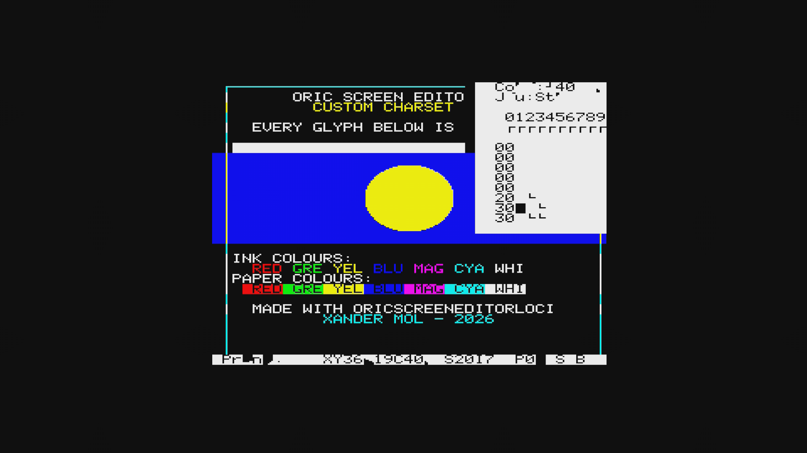

*Restaurer depuis la ROM*

Appuyez sur **S** (jeu Standard uniquement) pour copier le glyphe ROM du code écran actuel dans la RAM charset, écrasant toutes les modifications. Il n'existe pas de source ROM pour le jeu Alternatif — utilisez **Caract. > Reinitialiser Alt→Boot** depuis le menu principal pour restaurer toute la banque Alt depuis la capture du démarrage.

## Mode palette
([Retour au sommaire](#sommaire))

Appuyer sur **P** en mode principal ouvre le mode Palette. Une popup affiche les 10 emplacements favoris en première ligne, suivis du jeu Standard complet (codes $20–$7F, 6 lignes de 16), puis le jeu Alternatif complet (ou un réordonnancement en plan de caractères visuel, voir ci-dessous).

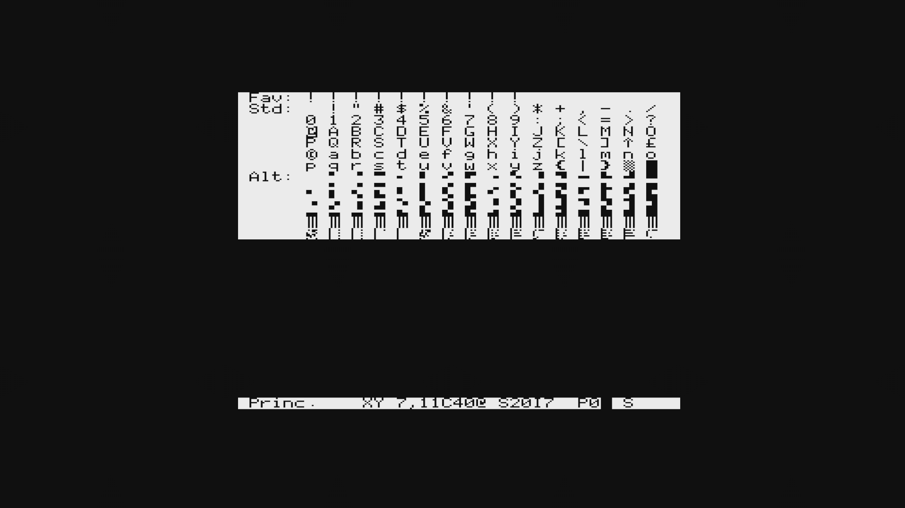

Commandes clavier :

|Touche|Description
|---|---|
|**Touches curseur**|Déplacer le curseur (avec rebouclage entre les sections)
|**ESPACE ou ENTRÉE**|Sélectionner le caractère en surbrillance et revenir au mode principal
|**0-9**|Enregistrer le caractère en surbrillance dans l'emplacement favori correspondant
|**V**|Basculer entre le mode normal et le mode plan de caractères **v**isuel
|**ESC**|Revenir au mode principal sans modifier le caractère sélectionné
|**FUNCT+6**|Basculer la visibilité de la barre d'état

*Mode plan de caractères visuel*

Appuyer sur **V** bascule le mode plan de caractères visuel, qui réordonne la section du jeu Alternatif de sorte que les caractères soient classés dans un ordre logique pour le dessin (conçu autour de la police mosaïque/semi-graphique native de l'Oric). Ce mode n'a de sens que pour un jeu Alternatif non modifié.

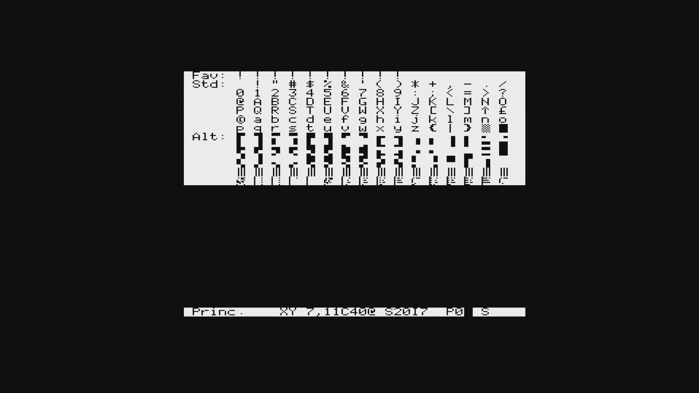

## Sélecteur de couleurs
([Retour au sommaire](#sommaire))

Appuyer sur **C** en mode principal ouvre le sélecteur de couleurs, qui fournit une grille visuelle pour sélectionner les couleurs d'encre et de papier.

La popup affiche les 64 combinaisons Encre/Papier sous forme d'une grille 8×8 (une ligne par couleur de papier, une colonne par couleur d'encre). Chaque cellule montre un échantillon de couleur normal et un inversé côte à côte. Trois lignes sous la grille affichent l'encre et le papier actuellement en surbrillance, ainsi qu'un aperçu normal/inversé résultant.

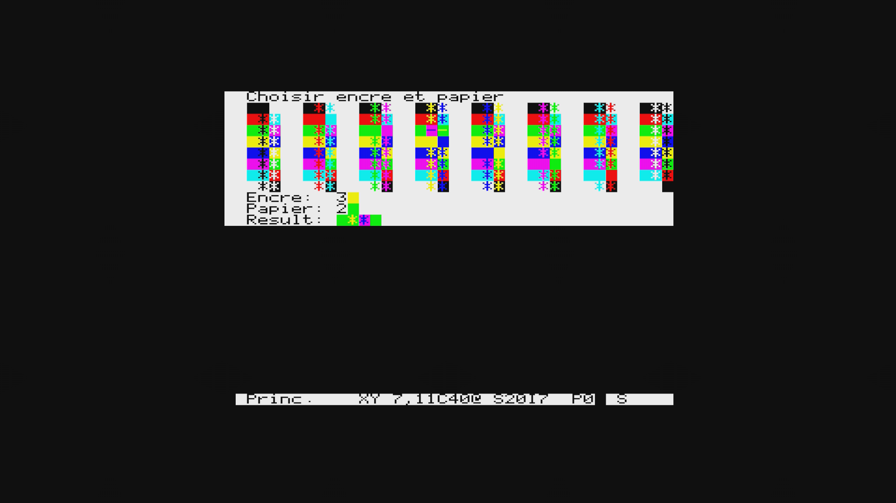

Commandes clavier :

|Touche|Description
|---|---|
|**Curseur GAUCHE / DROITE**|Faire défiler la couleur d'encre (rebouclage 0–7)
|**Curseur HAUT / BAS**|Faire défiler la couleur de papier (rebouclage 0–7)
|**ESPACE ou ENTRÉE**|Accepter la combinaison Encre/Papier en surbrillance et revenir au mode principal
|**ESC**|Revenir au mode principal sans modifier les couleurs Encre/Papier
|**FUNCT+6**|Basculer la visibilité de la barre d'état

## Mode sélection
([Retour au sommaire](#sommaire))

Appuyer sur **S** en mode principal entre en mode Sélection. Positionnez le curseur sur un coin de la zone à sélectionner avant d'entrer.

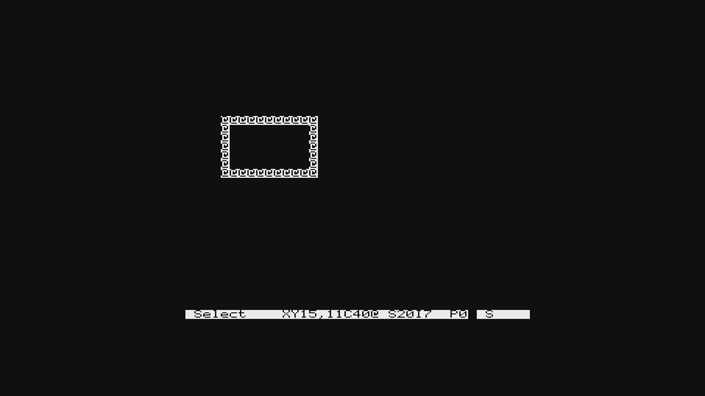

**Phase 1 — délimiter la sélection :** les touches curseur agrandissent ou contractent le rectangle depuis le coin de départ. La sélection est mise en surbrillance avec le code écran et les attributs actuels. Appuyez sur **ENTRÉE** pour accepter ; **ESC** annule et revient au mode principal. **FUNCT+8** affiche l'écran d'aide (uniquement avant que la sélection ait commencé à s'agrandir).

**Phase 2 — choisir l'action :** après avoir accepté, le champ mode de la barre d'état affiche les actions disponibles.


Appuyez sur :

|Touche|Description
|---|---|
|**X**|Couper : copier la sélection à un nouvel emplacement, effacer l'original
|**C**|**C**opier : copier la sélection à un nouvel emplacement, en laissant l'original intact
|**D**|Supprimer (**D**elete) : remplir la sélection d'espaces
|**I**|Peindre avec l'attribut **I**nk : remplir avec le modificateur d'encre actuel
|**P**|Peindre avec l'attribut **P**aper : remplir avec le modificateur de papier actuel
|**M**|Peindre avec l'attribut **M**odificateur de jeu de caractères
|**ESC**|Annuler et revenir au mode principal

**Couper et copier :** après avoir appuyé sur **X** ou **C**, déplacez le curseur jusqu'au coin supérieur gauche de la destination, puis appuyez sur **ENTRÉE** pour confirmer ou **ESC** pour annuler.


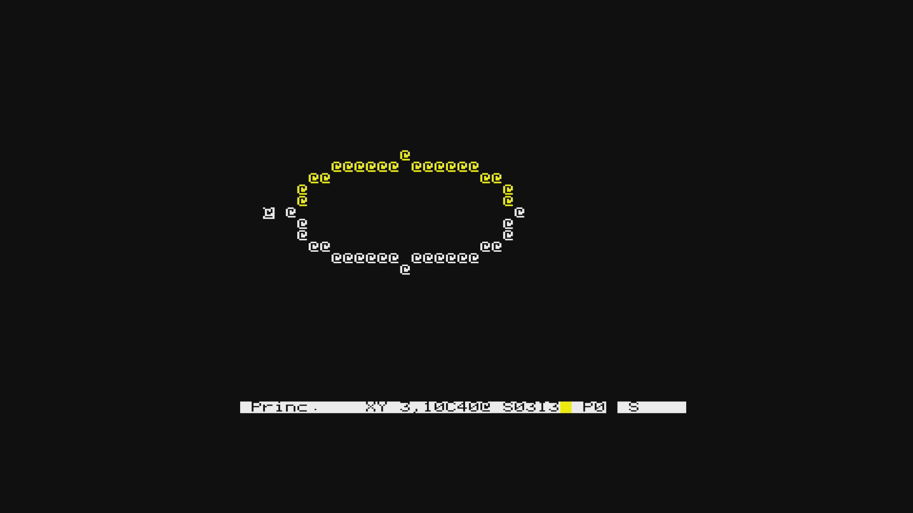 Si la sélection dépasserait les limites de la zone de dessin, un message "Selection hors limites." apparaît et rien ne change. Couper utilise deux emplacements d'annulation — revenir sur une coupe nécessite deux pressions sur **Z**.

Autres touches en mode Sélection :

|Touche|Description
|---|---|
|**Touches curseur**|Agrandir/réduire la sélection (phase 1) ou déplacer le curseur vers la destination (couper/copier)
|**ENTRÉE**|Accepter la sélection / confirmer la destination
|**ESC**|Annuler et revenir au mode principal
|**FUNCT+6**|Basculer la visibilité de la barre d'état
|**FUNCT+8**|Écran d'aide

## Mode déplacement
([Retour au sommaire](#sommaire))

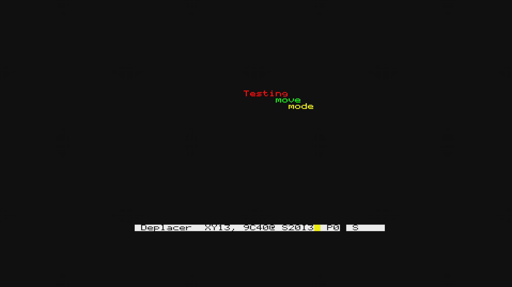

Appuyer sur **M** en mode principal entre en mode Déplacement. Utilisez ce mode pour faire défiler le contenu de la fenêtre visible actuelle dans n'importe quelle direction. Chaque pression sur une touche curseur décale toutes les cellules dans la zone de fenêtre de 40×28 d'un cran dans cette direction dans `screenmap[]` ; le contenu qui sort du bord est perdu.

**Note :** chaque décalage est appliqué immédiatement — RETOUR et ESC quittent tous les deux le mode Déplacement en conservant les décalages déjà effectués. Il n'y a pas de tampon de travail pour revenir en arrière. Utilisez **Z** (annuler) après avoir quitté si vous souhaitez revenir en arrière.

Le mode Déplacement n'agit que sur la zone de la fenêtre visible. Sur une zone de dessin plus grande que 40×28, seule la fenêtre de 40×28 visible est décalée ; les cellules hors de la fenêtre ne sont pas affectées.

|Touche|Description
|---|---|
|**Touches curseur**|Décaler le contenu de la fenêtre dans la direction sélectionnée
|**RETOUR ou ESC**|Quitter le mode Déplacement et revenir au mode principal
|**FUNCT+6**|Basculer la visibilité de la barre d'état
|**FUNCT+8**|Écran d'aide

## Mode ligne et boîte
([Retour au sommaire](#sommaire))

Appuyer sur **L** en mode principal entre en mode Ligne et boîte. Positionnez le curseur sur un coin de la boîte ou au début de la ligne avant d'entrer.

**Phase 1 — délimiter le rectangle englobant :**

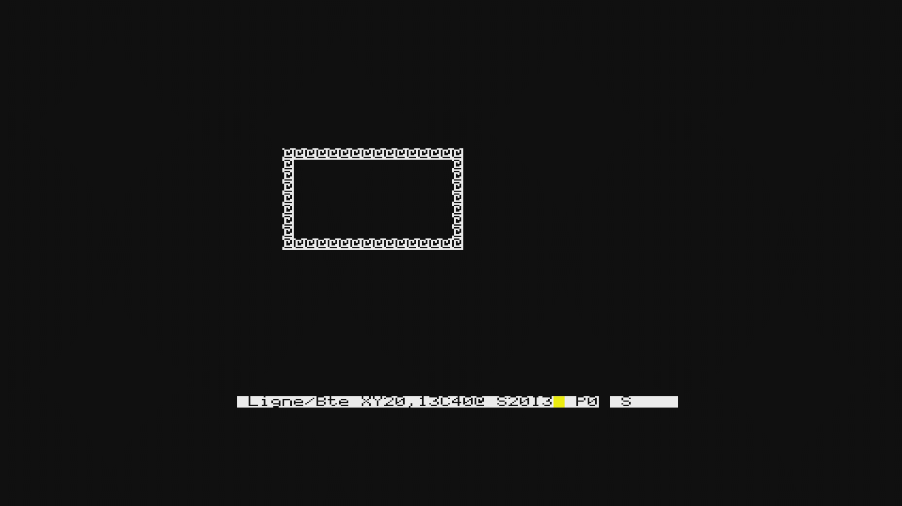 les touches curseur agrandissent ou contractent le rectangle. Si la largeur ou la hauteur reste à 1, une ligne est tracée ; sinon, une boîte ou une ellipse est tracée. Appuyez sur **ENTRÉE** pour accepter ; **ESC** annule et revient au mode principal.

**Phase 2 — options de forme :** après avoir accepté, la barre d'état affiche `o:Bte c:El` (avec des majuscules indiquant quelles bascules sont actives).


Appuyez sur :

|Touche|Description
|---|---|
|**O**|Basculer plein/creux (**O** en majuscule dans l'aide quand creux est activé)
|**C**|Basculer rectangle/ellipse (**C** en majuscule dans l'aide quand ellipse est activée)
|**ENTRÉE**|Tracer la forme avec les bascules actuelles
|**ESC**|Annuler sans tracer

Quatre formes résultent de la combinaison de ces bascules :
- Boîte pleine (par défaut)
- Boîte creuse (seules les quatre lignes de bordure sont tracées, l'intérieur reste intact)
- Ellipse pleine inscrite dans le rectangle englobant
- Contour d'ellipse creuse

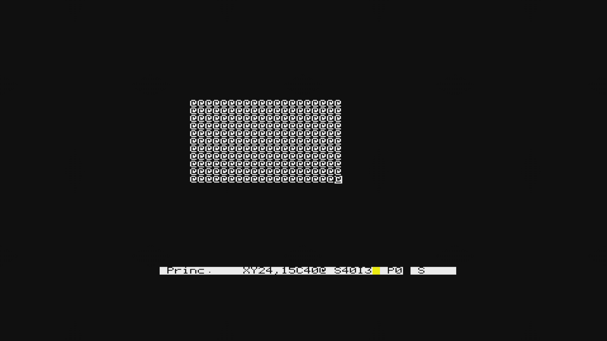

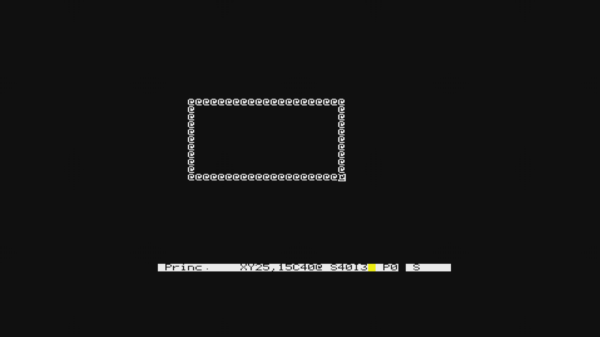

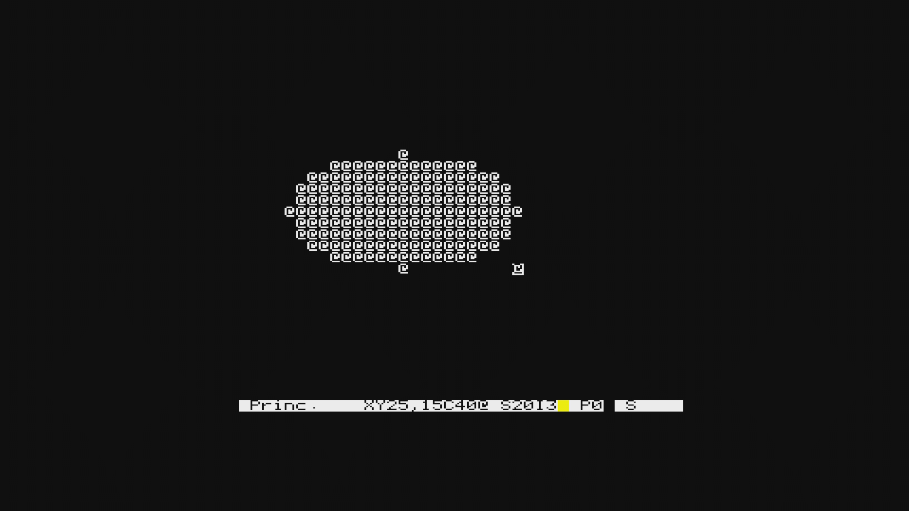

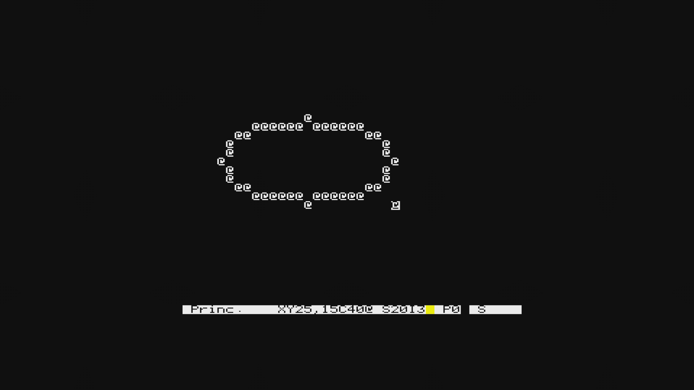

**Note sur les cellules de caractères et les ellipses :** les cellules de caractères Oric font 6 pixels de large × 8 pixels de haut. Un rectangle carré produit donc une ellipse visuellement aplatie, pas un cercle. Élargissez le rectangle si vous souhaitez un résultat plus rond.

|Touche|Description
|---|---|
|**Touches curseur**|Agrandir/réduire dans la direction sélectionnée (phase 1)
|**O**|Basculer plein/creux (phase 2)
|**C**|Basculer rectangle/ellipse (phase 2)
|**ENTRÉE**|Accepter (les deux phases)
|**ESC**|Annuler et revenir au mode principal
|**FUNCT+6**|Basculer la visibilité de la barre d'état
|**FUNCT+8**|Écran d'aide

## Mode écriture
([Retour au sommaire](#sommaire))

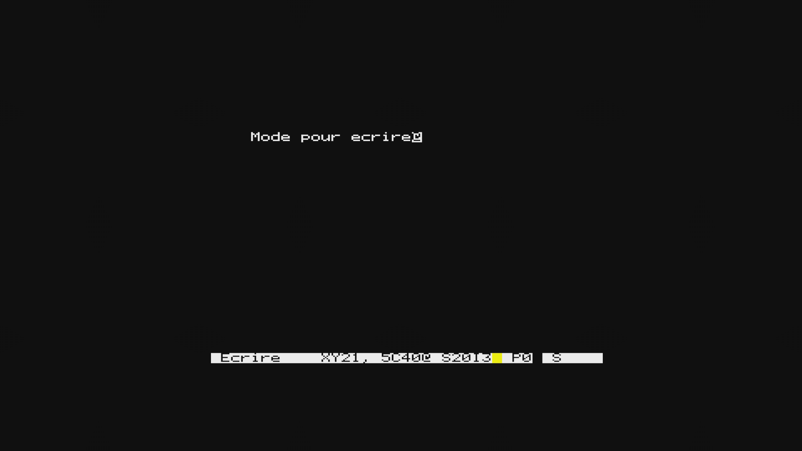

Appuyer sur **W** en mode principal entre en mode Écriture. Tapez librement des caractères avec le clavier — toute touche imprimable (code écran > 32) trace le caractère au curseur et avance d'une cellule vers la droite.

Les couleurs et attributs peuvent être réglés et tracés en mode écriture :

- **CTRL+Z** / **CTRL+X** — diminuer / augmenter la couleur d'encre
- **CTRL+C** / **CTRL+V** — diminuer / augmenter la couleur de papier
- **CTRL+B** / **CTRL+A** / **CTRL+D** — basculer clignotement / jeu alternatif / double hauteur
- **CTRL+R** — basculer la vidéo inversée (XOR du code écran avec 128)
- **FUNCT+1** — tracer un modificateur d'encre pour la couleur d'encre actuelle
- **FUNCT+2** — tracer un modificateur de papier pour la couleur de papier actuelle
- **FUNCT+3** — tracer un modificateur de jeu de caractères pour les réglages actuels
- **FUNCT+4** — saisie hexadécimale directe : choisissez **1** Encre / **2** Papier / **3** Modificateur, puis tapez un chiffre hexadécimal 0–7

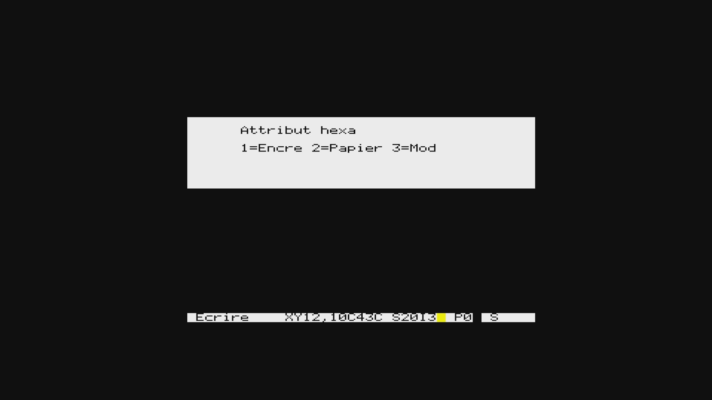

**DEL** déplace le curseur d'une cellule vers la gauche et efface cette cellule (style retour arrière). Il ne passe pas à la ligne précédente.

Quittez le mode Écriture avec **ESC**. **FUNCT+8** affiche l'écran d'aide pour ce mode.

|Touche|Description
|---|---|
|**Touches curseur**|Déplacer le curseur (avec défilement automatique)
|**DEL**|Déplacer vers la gauche et effacer cette cellule (retour arrière)
|**CTRL+A**|Basculer l'attribut jeu de caractères alternatif
|**CTRL+B**|Basculer l'attribut clignotement
|**CTRL+D**|Basculer l'attribut double hauteur
|**CTRL+R**|Basculer la vidéo inversée
|**CTRL+Z**|Diminuer la couleur d'encre
|**CTRL+X**|Augmenter la couleur d'encre
|**CTRL+C**|Diminuer la couleur de papier
|**CTRL+V**|Augmenter la couleur de papier
|**FUNCT+1**|Tracer le modificateur d'encre
|**FUNCT+2**|Tracer le modificateur de papier
|**FUNCT+3**|Tracer le modificateur de jeu de caractères
|**FUNCT+4**|Saisie hexadécimale directe d'attribut
|**ESC**|Revenir au mode principal
|**FUNCT+6**|Basculer la visibilité de la barre d'état
|**FUNCT+8**|Écran d'aide
|**Autres touches imprimables**|Tracer le caractère correspondant et avancer vers la droite

## Référence des valeurs de couleur
([Retour au sommaire](#sommaire))

L'Oric utilise des valeurs de couleur RGB sur 3 bits (rouge bit 0, vert bit 1, bleu bit 2) :

|Numéro|Couleur|Bits B-V-R|
|---|---|---|
|0|Noir|0-0-0|
|1|Rouge|0-0-1|
|2|Vert|0-1-0|
|3|Jaune|0-1-1|
|4|Bleu|1-0-0|
|5|Magenta|1-0-1|
|6|Cyan|1-1-0|
|7|Blanc|1-1-1|

## Référence des codes d'attribut série
([Retour au sommaire](#sommaire))

L'Oric ne dispose pas d'un espace mémoire d'attributs séparé. Un octet dans la grille de caractères dont la valeur est dans la plage 0–31 est interprété comme un attribut sériel plutôt qu'un caractère affichable. Les attributs prennent effet depuis leur colonne jusqu'au bout de la même ligne raster ; au début de chaque nouvelle ligne, le ULA réinitialise l'encre en blanc et le papier en noir. Les attributs de modificateur de jeu de caractères (codes 8–15) ne se réinitialisent **pas** par ligne — ils persistent jusqu'au prochain octet d'attribut de mode jeu.

Comme une cellule peut être soit un caractère soit un attribut mais pas les deux, insérer un attribut déplace le caractère qui s'y trouvait. Les mises en page multicolores nécessitent une colonne par changement d'attribut.

Pour le contexte complet : https://osdk.org/index.php?page=articles&ref=ART9

*Codes 0–7 : Changer l'encre*

|Code|Hex|Couleur d'encre|
|---|---|---|
|0|$00|Noir|
|1|$01|Rouge|
|2|$02|Vert|
|3|$03|Jaune|
|4|$04|Bleu|
|5|$05|Magenta|
|6|$06|Cyan|
|7|$07|Blanc|

Motif de bits : `0 0 0 0 0 Bleu Vert Rouge`

*Codes 8–15 : Modificateur de jeu de caractères*

Bit 3 activé. Les bits 0–2 contrôlent le jeu Alternatif (bit 0), la Double hauteur (bit 1), et le Clignotement (bit 2).

|Code|Hex|Effet|
|---|---|---|
|8|$08|Jeu Standard, sans double, sans clignotement|
|9|$09|Jeu Alternatif|
|10|$0A|Standard, double hauteur|
|11|$0B|Alternatif, double hauteur|
|12|$0C|Standard, clignotement|
|13|$0D|Alternatif, clignotement|
|14|$0E|Standard, double hauteur, clignotement|
|15|$0F|Alternatif, double hauteur, clignotement|

*Codes 16–23 : Changer le papier*

Bit 4 activé. Les bits 0–2 sont la valeur RGB (identique à l'encre).

|Code|Hex|Couleur de papier|
|---|---|---|
|16|$10|Noir|
|17|$11|Rouge|
|18|$12|Vert|
|19|$13|Jaune|
|20|$14|Bleu|
|21|$15|Magenta|
|22|$16|Cyan|
|23|$17|Blanc|

## Référence du format de fichier
([Retour au sommaire](#sommaire))

Tous les formats utilisés par OSE-LOCI sont des dumps binaires sans en-tête — pas de nombres magiques, pas de champs de métadonnées, pas de rembourrage. La seule exception est `PJ.BIN` (en-tête de projet), qui contient un marqueur `FILEIO_MAGIC` (`$4F53`) permettant la détection automatique du format V1.

### Ecran (`<nom>.BIN` — Fichier > Sauver/Charger écran)

Dump brut de `screenmap[]`.

| Offset | Taille | Contenu |
|--------|--------|---------|
| 0 | largeur × hauteur octets | Codes écran du canevas, ligne par ligne (de haut en bas) |

Sans en-tête : la largeur et la hauteur ne sont pas stockées dans le fichier — Charger écran vous demande de les saisir. Ecran standard 40×28 = 1 120 octets. Toute taille de canevas est valide.

### Combiné (`<nom>.BIN` — Fichier > Sauver/Charger combiné)

Dump de carte mémoire couvrant les deux jeux de caractères et le canevas. Seules les dimensions **40×28** et **40×27** sont acceptées. Le chargement détecte automatiquement la hauteur depuis la taille du fichier.

| Offset | Taille | Adresse de chargement | Contenu |
|--------|--------|-----------------------|---------|
| 0 | 768 | $B500–$B7FF | Plage affichable du jeu Standard (codes $20–$7F, 96 glyphes × 8 octets) |
| 768 | 256 | $B800–$B8FF | Préfixe non-affichable du jeu Alternatif (codes $00–$1F) |
| 1 024 | 640 | $B900–$BB7F | Plage affichable du jeu Alternatif (codes $20–$6F, 80 glyphes × 8 octets) |
| 1 664 | 40 × hauteur | $BB80+ | Codes écran du canevas, ligne par ligne |

Taille totale : **2 784 octets** (40×28) ou **2 744 octets** (40×27).

### Projet (quatre fichiers — Fichier > Sauver/Charger projet)

| Fichier | Taille | Contenu |
|---------|--------|---------|
| `<nom>PJ.BIN` | 22 octets | `ProjectHeader` : taille du canevas, positions curseur/décalages, attributs de tracé, indicateurs `stdchanged`/`altchanged`, marqueur `FILEIO_MAGIC` ($4F53) |
| `<nom>SC.BIN` | largeur × hauteur octets | Codes écran du canevas (brut, sans en-tête ; taille issue de PJ.BIN) |
| `<nom>CS.BIN` | 768 octets | Plage affichable du jeu Standard (écrit/lu uniquement si `stdchanged` est actif) |
| `<nom>CA.BIN` | 640 octets | Plage affichable du jeu Alternatif, codes $20–$6F (écrit/lu uniquement si `altchanged` est actif) |

Les fichiers de projet V1 (version CC65) utilisent un format d'en-tête de 19 octets, détecté automatiquement via le marqueur magic.

### Fichiers jeu de caractères (menu Caract.)

| Format | Fichier | Taille | Contenu |
|--------|---------|--------|---------|
| Standard | `<nom>.BIN` | 768 octets | Plage affichable CHARSET_STD, $B500–$B7FF |
| Alternatif | `<nom>.BIN` | 640 octets | Plage affichable CHARSET_ALT, $B900–$BB7F (codes $20–$6F uniquement ; les codes $70–$7F chevaucheraient la RAM écran) |
| Combiné | `<nom>.BIN` | 1 664 octets | Même disposition que Fichier > Combiné mais sans l'écran : 768 octets Standard + 256 octets préfixe non-affichable Alternatif + 640 octets Alternatif affichable. Les deux banques sont chargées/sauvegardées ensemble. |

## Crédits
([Retour au sommaire](#sommaire))

Oric Screen Editor pour LOCI

Éditeur d'écran pour l'Oric Atmos

OSE-LOCI écrit en 2024–2026 par Xander Mol

Basé sur OricScreenEditor V1 (2022) par Xander Mol

https://github.com/xahmol/OricScreenEditorLOCI

https://www.idreamtin8bits.com/

Code et ressources d'autres personnes utilisés :

-   **Compilateur croisé Oscar64** par drmortalwombat (compilateur C 6502 utilisé pour ce projet)

    https://github.com/drmortalwombat/oscar64

-   **ROM et matériel LOCI** par Sodiumlightbaby et sodiumlb

    https://github.com/sodiumlb/loci-rom
    https://github.com/sodiumlb/loci-hardware

-   **Émulateur Phosphoric** par benedictemarty (utilisé pour la suite de tests automatisés)

    https://github.com/benedictemarty/Phosphoric

-   **Driver joystick Raxiss IJK** depuis oricOpenLibrary

    https://github.com/iss000/oricOpenLibrary

-   **jab / Artline Designs (Jaakko Luoto)** pour l'inspiration du mode plan de caractères visuel en palette

-   **Bart van Leeuwen et forum.defence-force.org** pour l'inspiration et les conseils

-   Testé sur matériel réel Oric Atmos avec LOCI, et avec les émulateurs Phosphoric et Oricutron

Le code peut être utilisé librement à condition de conserver
une mention décrivant la source et l'auteur d'origine.

LES PROGRAMMES SONT DISTRIBUÉS DANS L'ESPOIR QU'ILS SERONT UTILES,
MAIS SANS AUCUNE GARANTIE. UTILISEZ-LES À VOS PROPRES RISQUES !

([Retour au sommaire](#sommaire))
